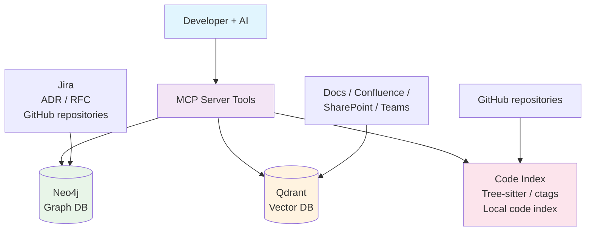

## Knowledge System MVP - Summary and Stack

### System Goal

Creating a local knowledge system for developers in large organizations, integrating:

* Source code (Your repositories and other teams' repos)
* Jira (epics, stories)
* Documentation in Confluence, SharePoint, Teams
* ADR/RFC (architectural decisions)

The goal is to enable AI (e.g., Copilot, OpenCode) quick access to:

* Project context (C4: Code / Component / Container / System)
* Current best practices and technical decisions
* Historical information and relationships between projects

### High-level Architecture



### Technologies and Tools

| Component                          | Technology              | License          | Notes / Local usage                                                                     |
| ---------------------------------- | ------------------------ | ----------------- | ------------------------------------------------------------------------------------------ |
| Code index                        | Tree-sitter              | MIT               | Code parsing, extracting classes, functions, modules. Offline, Python binding `tree-sitter`. |
| Index alternative                | Universal Ctags          | MIT               | Fast symbol index, less semantic.                                                   |
| Knowledge graph                        | Neo4j Community Edition  | GPLv3             | C4 modeling, decisions, relationships. Local host possible.                                      |
| Vector DB                          | Qdrant / Weaviate        | Apache 2.0 / dual | Embeddings from documents, ADR, Jira. Local deployment in Docker.                         |
| MCP Server                         | OpenAI Agents Python SDK | MIT/Apache        | Provides AI tools for querying graph / index / vector DB. Local server.         |
| Watchdog                           | Python watchdog          | MIT               | Monitoring changes in repo and documents, auto-update graph / index.                      |
| Jira / GitHub / Confluence / Teams | API                      | –                 | Data retrieval to graph / embeddings. Requires access to services.                       |

### Workflow Example

1. You receive a story in Jira.
2. AI asks MCP: `fetch_context(story_id)`.
3. MCP server checks:

   * Graph (Neo4j) → epic, related service, technologies.
   * Vector DB (Qdrant) → documentation, best practices, ADR.
   * Code index (Tree-sitter / ctags) → existing functions/methods.
4. MCP returns response:

   * Project context
   * Applicable technologies
   * Links to documentation and code examples
   * Warnings about deprecated / superseded docs.

### MVP Roadmap

1. **Phase 1 (2–3 weeks)**

   * Neo4j + MCP server + code index (Tree-sitter)
   * Jira ingestor → epics/stories graph
   * Relations: story → service → technologies

2. **Phase 2**

   * Vector DB (Qdrant) → documentation, ADR, ticket descriptions
   * MCP tool: `recommend_best_practices`

3. **Phase 3**

   * Confluence, SharePoint, Teams integration
   * Marking documents as deprecated / superseded

4. **Phase 4**

   * Full C4: containers, systems, context
   * Auto-update graph via watcher / webhooks

### Example MCP Tool (Python)

```python
from mcp.server import Server
import subprocess
from neo4j import GraphDatabase

server = Server("code-knowledge")

@server.tool()
def fallback_rg(pattern: str, path: str = ".") -> str:
    result = subprocess.run(["rg", pattern, path], capture_output=True, text=True)
    return result.stdout

@server.tool()
def graph_query(cypher: str) -> list:
    driver = GraphDatabase.driver("bolt://localhost:7687", auth=("neo4j", "password"))
    with driver.session() as session:
        result = session.run(cypher)
        return [r.data() for r in result]

if __name__ == "__main__":
    server.run_stdio()
```

### Summary

* All components are **open source and local**.
* System integrates **C4, code index, vector DB and knowledge base**.
* AI can use MCP tools to get **full context of code, history and documentation**.
* Roadmap allows MVP deployment in a few weeks and later expansion with additional sources and C4 layer.

---

**Mermaid architecture diagram:** See diagram above (replaces `knowledge_system_architecture.png`)
