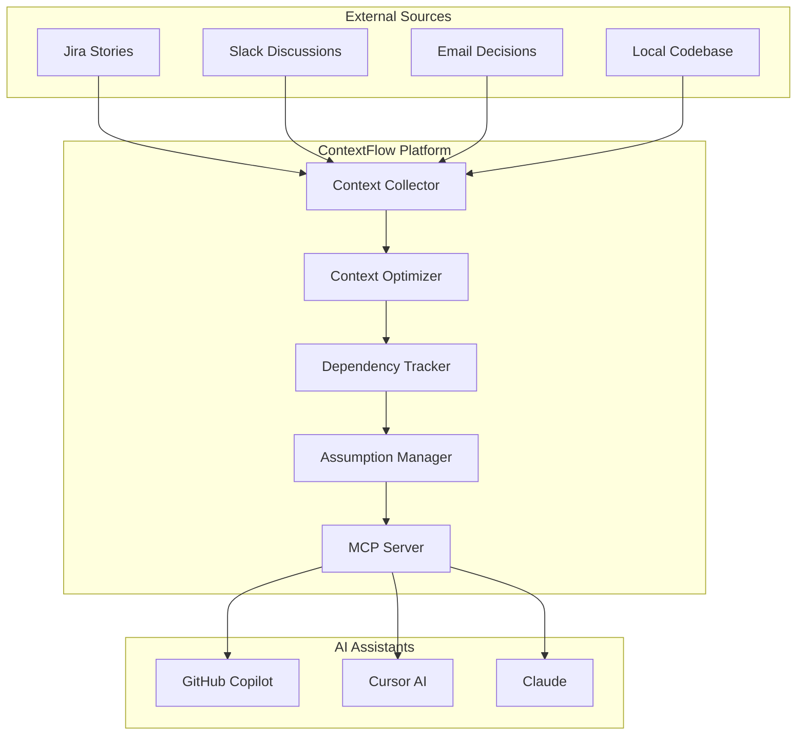

# ContextFlow
*Context Engineering Platform for AI-Powered Development*

**ContextFlow** transforms generic AI assistants into organization-aware development partners through intelligent context management, solving the critical problems that make AI development assistance frustrating and unreliable.

## The Problems We Solve

### 🔥 **Context Bloat Kills AI Performance**
```
Day 1: AI agent works perfectly
Day 10: Getting slower, more MCP tools added
Day 20: Context compacting, losing previous decisions
Result: 🔄 Constant restarts, lost productivity
```

### 🔗 **AI Forgets Cross-File Dependencies** 
```
❌ Current AI: "Rename 'email' to 'emailAddress'"
   [Changes only current file] ✅ Done!
   Result: 🔥 Breaks 7 files, tests fail

✅ ContextFlow: "This affects 7 files:
   - User.java:23 (@Column annotation)
   - application.yml:67 (validation key) 
   - user-requests.http:8 (test request)
   Should I prepare complete changeset?"
   Result: ✅ All files updated correctly
```

### 📉 **Requirements Change Mid-Development**
```
Plan: REST API integration
Reality: API too slow → switch to Pub/Sub
Result: 🗑️ Orphaned REST code, async refactor, config chaos
```

### 🏗️ **Integration Hell**
```
Need: Jira + Slack + Email + Confluence integration
Reality: Different APIs, auth methods, rate limits
Result: 😵 Maintenance nightmare, inconsistent patterns
```

## The ContextFlow Solution

**Context Engineering** is the systematic design, collection, and delivery of relevant contextual information to AI systems. ContextFlow provides:

- **🎯 Dynamic Context Optimization**: 60-70% context reduction, sub-2 second responses
- **🔗 Cross-File Dependency Tracking**: 95% accuracy in change impact analysis
- **📋 Assumption Management**: Track architectural decisions, handle invalidation cascades
- **🔌 MCP Hub Architecture**: Unified integration with Jira, Slack, Email, Confluence
- **🛡️ Privacy-First**: Everything runs locally, complete organizational control

## How It Works



## Quick Start

### Prerequisites
- Python 3.11+
- Node.js 18+ (for MCP servers)
- Git repository to analyze

### Installation
```bash
# Install ContextFlow
uv pip install contextflow

# Or clone and install from source
git clone https://github.com/your-org/contextflow
cd contextflow
uv pip install -e .
```

### Basic Usage
```bash
# Start ContextFlow in your project directory
contextflow init
contextflow start

# Your AI assistants now have access to:
# - Cross-file dependencies
# - Project context from Jira
# - Team decisions from Slack
# - Architectural constraints
```

### Configuration
```yaml
# contextflow.yml
contextflow:
  sources:
    local_code:
      enabled: true
      paths: ["src/", "tests/"]
      
    jira:
      enabled: true
      server_url: "https://company.atlassian.net"
      projects: ["BACKEND", "API"]
      
    slack:
      enabled: true
      channels: ["#backend", "#architecture"]
      
  optimization:
    max_context_size: 8000
    query_classification: true
    dynamic_loading: true
```

## Architecture

### Core Components

- **Context Collector**: Gathers information from code, Jira, Slack, email
- **Context Optimizer**: Dynamically selects relevant context per query
- **Dependency Tracker**: Maps relationships between files, configs, docs
- **Assumption Manager**: Tracks architectural decisions and handles changes
- **MCP Server**: Provides context to AI assistants via Model Context Protocol

### Technology Stack

- **Core**: Python 3.11+, SQLite/Neo4j, Qdrant (vector search)
- **Parsing**: Tree-sitter (code), YAML/JSON parsers (config)
- **Integration**: MCP Protocol, REST APIs, WebSockets
- **AI Integration**: Compatible with GitHub Copilot, Cursor, Claude, ChatGPT

## Development Status

🚧 **Currently in Research & Design Phase**

### Roadmap

#### Phase 1: Core Context Engineering (4-5 weeks)
- [x] Problem analysis and solution design
- [ ] Dynamic context optimization
- [ ] Cross-file dependency tracking
- [ ] Basic MCP server integration
- [ ] SQLite-based storage

#### Phase 2: Plugin Integration (3-4 weeks)
- [ ] MCP client manager
- [ ] Jira integration
- [ ] Slack integration
- [ ] Privacy filtering

#### Phase 3: Advanced Features (3-4 weeks)
- [ ] Assumption tracking
- [ ] Vector search integration
- [ ] Context caching and summarization
- [ ] Advanced pattern recognition

#### Phase 4: Production Ready (3-4 weeks)
- [ ] Neo4j migration
- [ ] Performance optimization
- [ ] Enterprise deployment
- [ ] Monitoring and observability

## Contributing

We're in the early research phase and looking for:

- **Problem Validation**: Share your AI development pain points
- **Technical Feedback**: Architecture and implementation suggestions
- **Use Case Examples**: Real-world scenarios we should support

### Research Documents

Comprehensive analysis available in [`research/`](research/) directory:
- [Context Engineering Concept](research/problem-analysis/CONTEXT_ENGINEERING.md)
- [Cross-File Dependencies](research/problem-analysis/CROSS_FILE_DEPENDENCIES.md)
- [Context Optimization](research/problem-analysis/CONTEXT_OPTIMIZATION.md)
- [Architecture Options](research/architecture/ARCHITECTURE_OPTIONS.md)
- [Executive Summary](research/EXECUTIVE_SUMMARY.md)

## Why ContextFlow?

### The Problem with Current AI Assistants

AI assistants like GitHub Copilot and Cursor are powerful but limited by:
- No organizational context
- Context bloat over time
- Missing cross-file relationships
- No architectural constraint awareness
- Generic suggestions without team patterns

### Our Unique Approach

**ContextFlow** is the first **Context Engineering Platform** specifically designed to solve these problems through:

1. **Intelligent Context Management**: Dynamic optimization prevents bloat
2. **Cross-System Integration**: Unified view of code, projects, and communications
3. **Local-First Privacy**: Complete control over your organizational data
4. **AI-Agnostic Design**: Works with any AI assistant via MCP protocol

## License

MIT License - see [LICENSE](LICENSE) file for details.

## Contact

- **Issues**: [GitHub Issues](https://github.com/your-org/contextflow/issues)
- **Discussions**: [GitHub Discussions](https://github.com/your-org/contextflow/discussions)
- **Email**: contact@contextflow.dev

---

*ContextFlow: Transforming AI development assistance through intelligent context engineering.*
