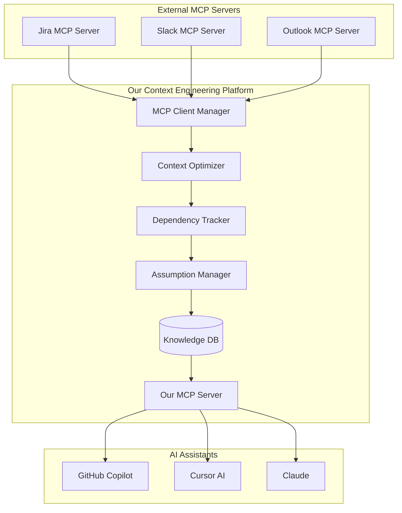

# Executive Summary: Context Engineering for AI Assistants

## The Context Engineering Opportunity

We've identified **Context Engineering** as an emerging discipline that can transform generic AI assistants into organization-aware development partners. Through comprehensive problem analysis, we've uncovered 5 critical challenges that current solutions don't address.

## Critical Problems Identified

### 🔥 **Problem #1: Context Bloat & AI Performance Degradation**
**The Issue**: AI agents accumulate context over time, leading to performance degradation and context compacting that loses important details.

**Current Experience**:
```
Day 1: Agent works great → Day 20: Context compacting, need restart
Result: Constant context management overhead
```

**Our Solution**: Dynamic Context Optimization
- Hierarchical context architecture (Core/Domain/Tool/Session layers)
- Query classification for minimal context selection
- Just-in-time context loading
- Target: 60-70% context reduction, sub-2 second responses

### 🔗 **Problem #2: Cross-File Dependencies Blind Spot**  
**The Issue**: AI assistants make changes to one file without recognizing related dependencies in other files.

**Real Example**:
```
❌ Current: "Rename property 'email' to 'emailAddress'"
AI: [Changes only current file] ✅ Done!
Result: 🔥 Breaks 7 other files (User.java, application.yml, user-requests.http)

✅ With Context Engineering: 
"This affects 7 files. Should I prepare complete changeset?"
```

**Our Solution**: Cross-File Dependency Tracking
- Real-time dependency mapping across file types
- Pattern recognition (Java @Value → YAML properties → HTTP tests)
- Complete change impact analysis

### 📉 **Problem #3: Assumption Invalidation Cascade**
**The Issue**: Architectural assumptions change mid-development, creating cascading changes and orphaned code.

**Real Scenario**:
```
Initial: REST API integration → Reality: API too slow, switch to Pub/Sub
Result: Orphaned REST client, async API needed, config changes, documentation updates
```

**Our Solution**: Assumption Tracking & Change Management
- Track assumptions with confidence levels and evidence
- Impact analysis for assumption changes
- Cleanup checklists and completeness verification
- Target: 40% reduction in architectural change time

### 🏗️ **Problem #4: Plugin Integration Complexity**
**The Issue**: Modern development requires integration with multiple systems (Jira, Slack, Email, Confluence) but each has different APIs and patterns.

**Our Solution**: MCP Hub Architecture
- Bidirectional MCP: consume context (client) + provide context (server)
- Standardized plugin system for data sources
- Privacy-aware context classification and filtering

### 📄 **Problem #5: Documentation Drift & Inconsistency** 
**The Issue**: Documentation becomes inconsistent as projects evolve, requirements change, and context accumulates.

**Meta-Example**: Our own research documents experienced this problem during analysis.

**Our Solution**: Living Documentation System
- Cross-document consistency checking
- Hierarchical document relationships
- Automated inconsistency detection

## Market Opportunity

### Current Solutions Fall Short
- **Sourcegraph**: Code search, no AI context optimization
- **GitHub Copilot**: AI assistance, but context bloat and no organizational context
- **Cursor**: Better context than Copilot, but still context bloat issues
- **Backstage**: Service catalog, limited AI integration

### Our Unique Value Proposition
**"First Context Engineering Platform that transforms generic AI assistants into organization-aware development partners through intelligent context management, cross-file dependency tracking, and assumption invalidation handling."**

## Technical Architecture

### MCP Hub with Progressive Complexity


## Implementation Strategy

### Phase 1: Core Context Engineering (4-5 weeks)
**Priority Problems**: Context Optimization + Cross-File Dependencies
- Dynamic context optimization with query classification
- Cross-file dependency tracking for major file types (Java, YAML, HTTP)
- Basic MCP server with context injection tools
- SQLite-based storage with real-time updates

### Phase 2: Plugin Integration (3-4 weeks)  
**Priority Problems**: Plugin System + Documentation Consistency
- MCP client manager for external data sources
- Jira and Slack integration via MCP
- Privacy filtering and data classification
- Documentation consistency checking

### Phase 3: Advanced Context Management (3-4 weeks)
**Priority Problems**: Assumption Management + Advanced Optimization
- Assumption tracking and invalidation impact analysis
- Context caching and summarization
- Vector search integration (Qdrant)
- Advanced pattern recognition

### Phase 4: Production Scale (3-4 weeks)
- Neo4j migration for complex relationships
- Performance optimization and monitoring
- Multi-agent context coordination
- Enterprise deployment features

## Success Metrics

### Technical Performance
- **Context Size Reduction**: 60-70% for typical queries
- **Cross-File Accuracy**: 95% accuracy in dependency detection
- **Response Time**: Sub-2 second for common queries
- **Context Continuity**: 90% reduction in context compacting events
- **Change Completeness**: 80% reduction in orphaned code

### Business Impact
- **Development Time**: 40% reduction in architectural change time
- **AI Effectiveness**: Significant improvement in AI suggestion quality
- **Developer Satisfaction**: Reduced friction in AI-assisted development
- **Knowledge Discovery**: New insights through cross-source correlation

## Market Positioning

### Primary Market: Large Organizations
- Complex codebases with multiple teams
- High privacy requirements (local-first approach)
- Existing AI assistant adoption
- Knowledge scaling challenges

### Secondary Market: Mid-Size Growing Companies
- Developer productivity concerns
- Increasing technical debt
- Need for better development workflows

## Competitive Advantages

1. **First-Mover in Context Engineering**: New discipline, no direct competitors
2. **Local-First Privacy**: Complete control over organizational data
3. **Cross-File Intelligence**: Unique capability not available elsewhere
4. **AI Optimization Focus**: Specifically designed for AI assistant enhancement
5. **Plugin Ecosystem**: Leverages and contributes to MCP ecosystem

## Investment Requirements

### Development Timeline: 13-17 weeks for full MVP
### Key Risks: 
- MCP ecosystem adoption rate
- Technical complexity of context optimization
- User adoption and workflow integration

### Mitigation Strategies:
- Start with local-only features (cross-file dependencies)
- Progressive rollout with immediate value delivery
- Strong focus on developer experience and workflow integration

## Conclusion

Context Engineering represents a significant opportunity to solve real problems that every developer using AI experiences daily. Our comprehensive problem analysis has identified specific, measurable issues with clear solutions and strong market differentiation.

The combination of **Context Optimization**, **Cross-File Dependencies**, **Assumption Management**, and **Plugin Integration** creates a compelling value proposition that no existing solution addresses holistically.

**Recommendation**: Proceed to Phase 1 implementation focusing on Core Context Engineering with immediate focus on Context Optimization and Cross-File Dependency tracking.