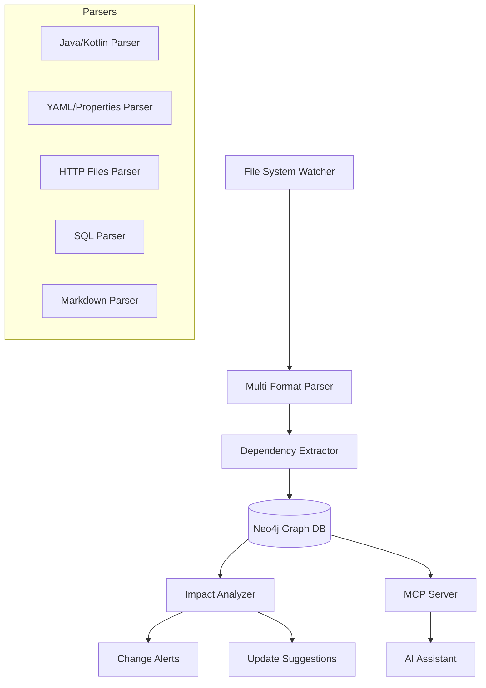
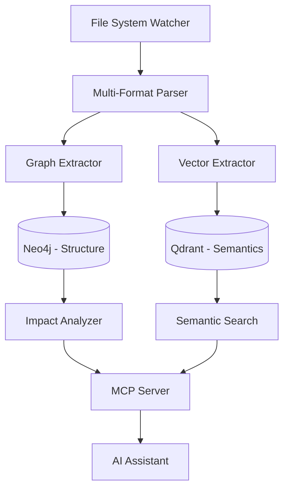
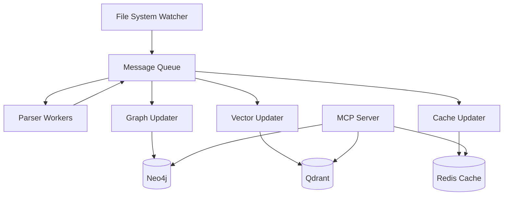
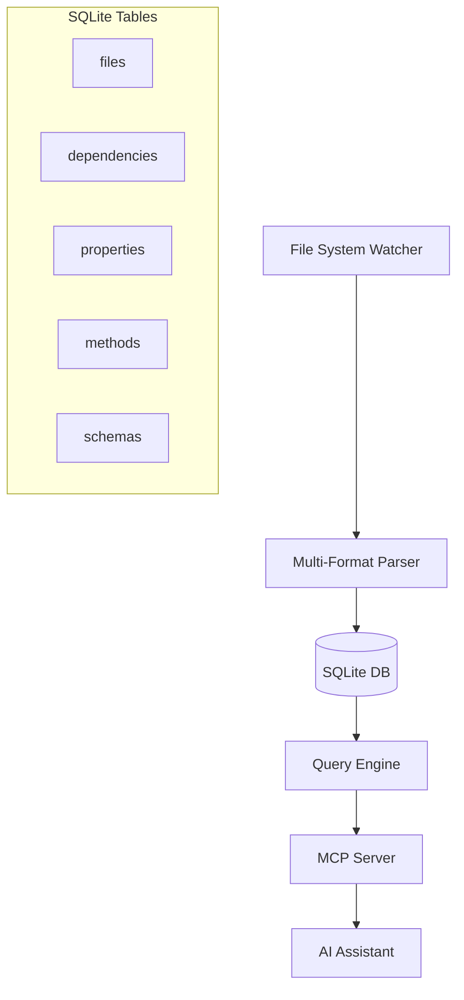

# Architecture Options for Cross-File Dependency Tracking

## Core Requirements Driven by Cross-File Dependencies

Based on the cross-file dependency problem analysis, our architecture must support:

1. **Real-time dependency mapping** across heterogeneous file types
2. **Change impact analysis** with cascading effect detection
3. **Multi-format parsing** (Java, YAML, JSON, HTTP, SQL, Markdown, etc.)
4. **Pattern recognition** across different naming conventions
5. **Context injection** into AI assistants via MCP protocol

## Architecture Option 1: Graph-Centric with Real-time Updates



### Strengths:
- **Real-time updates**: Changes reflected immediately in dependency graph
- **Rich relationships**: Graph DB excellent for complex dependency modeling
- **Query flexibility**: Cypher queries for complex dependency analysis
- **Scalability**: Neo4j handles large codebases well

### Weaknesses:
- **Single point of failure**: Graph DB must be always available
- **Complexity**: Neo4j setup and maintenance overhead
- **Performance**: Real-time updates may impact developer workflow
- **Data consistency**: Ensuring graph stays in sync with files

### Technical Implementation:
```python
# Example dependency tracking in Neo4j
class DependencyTracker:
    def track_property_reference(self, property_name, file_path, line_number):
        query = """
        MERGE (p:Property {name: $property_name})
        MERGE (f:File {path: $file_path})
        MERGE (p)-[r:REFERENCED_IN {line: $line_number, type: 'usage'}]->(f)
        """
        self.neo4j.run(query, property_name=property_name, 
                      file_path=file_path, line_number=line_number)
    
    def find_impact(self, property_name):
        query = """
        MATCH (p:Property {name: $property_name})-[r:REFERENCED_IN]->(f:File)
        RETURN f.path, r.line, r.type
        """
        return self.neo4j.run(query, property_name=property_name)
```

## Architecture Option 2: Vector + Graph Hybrid



### Strengths:
- **Best of both worlds**: Structural relationships + semantic understanding
- **Flexible queries**: Exact matches via graph, fuzzy matches via vector search
- **Context richness**: Can find similar patterns across codebase
- **Resilience**: Failure in one component doesn't break the other

### Weaknesses:
- **Complexity**: Managing two different databases
- **Consistency**: Keeping graph and vector DB in sync
- **Resource usage**: Higher memory and storage requirements
- **Query coordination**: Complex logic to combine results from both sources

### Use Cases:
- **Structural queries**: "Find all files that reference this property"
- **Semantic queries**: "Find similar configuration patterns"
- **Impact analysis**: "What would break if I change this?"
- **Pattern discovery**: "Show me all endpoints that follow this pattern"

## Architecture Option 3: Event-Driven with Message Queue



### Strengths:
- **Scalability**: Can handle high-throughput file changes
- **Reliability**: Event replay, dead letter queues
- **Modularity**: Easy to add new processors
- **Performance**: Caching layer for fast responses

### Weaknesses:
- **Complexity**: Event sourcing patterns, message ordering
- **Latency**: Processing delays due to async nature
- **Infrastructure**: Requires message queue setup
- **Debugging**: Harder to trace issues across async components

## Architecture Option 4: Local-First with SQLite



### Strengths:
- **Simplicity**: Single file database, no server setup
- **Performance**: Fast queries for most use cases
- **Portability**: Easy to backup, share, version control
- **Low overhead**: Minimal resource requirements

### Weaknesses:
- **Limited scalability**: Not suitable for very large codebases
- **Query limitations**: No native graph queries
- **Concurrent access**: Limited multi-user scenarios
- **Advanced features**: No semantic search without extensions

### SQL Schema Example:
```sql
CREATE TABLE dependencies (
    id INTEGER PRIMARY KEY,
    source_file TEXT NOT NULL,
    source_line INTEGER,
    target_type TEXT NOT NULL, -- 'property', 'method', 'class', etc.
    target_name TEXT NOT NULL,
    dependency_type TEXT NOT NULL, -- 'references', 'defines', 'extends'
    created_at TIMESTAMP DEFAULT CURRENT_TIMESTAMP
);

CREATE INDEX idx_target ON dependencies(target_type, target_name);
CREATE INDEX idx_source ON dependencies(source_file);
```

## Recommended Architecture: MCP Hub with Progressive Complexity

**UPDATED**: Based on plugin system analysis, I recommend a **MCP Hub Architecture** that starts simple and evolves:

### Phase 1: Core + Basic Plugins (3-4 weeks)
- SQLite for dependency storage
- File watchers for real-time updates
- Basic parsers for Java, YAML, HTTP files
- **Plugin system architecture**
- **MCP Client Manager for external data sources**
- **Our MCP Server for AI integration**
- Simple Jira + GitHub plugins

### Phase 2: Communication Integration (2-3 weeks)
- Add Slack/Teams plugins via MCP
- Email integration (Outlook/Gmail) via MCP
- Knowledge extraction from conversations
- Privacy filtering and data classification

### Phase 3: Enhanced Intelligence (3-4 weeks)
- Integrate Qdrant for semantic search
- Add embedding generation for patterns
- Cross-source correlation (email ↔ code ↔ issues)
- Advanced context building

### Phase 4: Production Scale (3-4 weeks)
- Migrate to Neo4j for complex relationships
- Event-driven plugin architecture
- Performance optimizations
- Monitoring and observability

## Key Technical Decisions

### 1. Parser Strategy
**Decision**: Use Tree-sitter for structured code, regex patterns for config files
**Reasoning**: Tree-sitter provides accurate AST parsing, regex sufficient for simple config formats

### 2. Update Strategy  
**Decision**: File watcher with debounced batch updates
**Reasoning**: Balance between real-time updates and performance impact

### 3. MCP Integration
**Decision**: Dedicated MCP server with caching layer
**Reasoning**: Fast response times critical for AI assistant UX

### 4. Data Storage
**Decision**: Start with SQLite, migrate to hybrid approach
**Reasoning**: SQLite sufficient for MVP, provides clear migration path

## MCP-Inspired Architectural Enhancements

Based on analysis of existing MCP projects, here are key architectural patterns we can adopt and extend:

### Knowledge Graph Patterns (from atlas-mcp-server)
- **Three-tier hierarchy**: Projects → Tasks → Knowledge for better organization
- **Task-context relationships**: Rich linking between work items and knowledge
- **Recommendation**: Adopt similar tiering for our context management graph

### Decision Analysis Integration (from mcp-adr-analysis-server)
- **Architectural Decision Records**: Specialized parsing and analysis of ADRs
- **Automated extraction**: Alternatives, rationales, and decision evolution
- **Recommendation**: Integrate ADR analysis into our document processing pipeline

### Reasoning Workflows (from mcp-chain-of-draft-server)
- **Systematic refinement**: Iterative improvement for complex decisions
- **Structured approach**: API design, architecture decisions, code reviews
- **Recommendation**: Implement decision-making frameworks for architectural queries

### Agent Orchestration Scalability (from claude-flow)
- **Distributed coordination**: Multi-agent systems with enterprise scalability
- **Intelligent routing**: Domain-specific expert assignment
- **Recommendation**: Design our MCP server for multi-agent extensibility

### User Interface Patterns (from mcp-web-ui)
- **Context aggregation**: Unified view of multiple data sources
- **Interactive exploration**: Web-based context navigation
- **Recommendation**: Develop web interfaces for context exploration and management

### Implementation Roadmap Integration

**Phase 1 Enhancement**: Add basic ADR parsing to document analysis
**Phase 2 Enhancement**: Implement hierarchical knowledge organization
**Phase 3 Enhancement**: Add structured reasoning workflows
**Phase 4 Enhancement**: Scale to multi-agent orchestration

## Research Priorities

### Immediate (Next 2 weeks):
1. **Parser prototype**: Test Tree-sitter with real Java codebases
2. **Dependency extraction**: Build algorithms for property/method tracking
3. **MCP integration**: Create basic tools for AI context injection

### Short-term (2-4 weeks):
1. **Performance testing**: Measure indexing speed on large repositories
2. **Accuracy validation**: Test dependency detection accuracy
3. **AI integration**: Test with real AI assistants (Copilot, Cursor)

### Medium-term (1-2 months):
1. **Production deployment**: Test in real development environment
2. **User validation**: Gather feedback from actual developers
3. **Scalability testing**: Performance with multiple large repositories

Ten problem z cross-file dependencies, który podniósłeś, jest naprawdę kluczowy i powinien być centralnym elementem naszej architektury. To konkretny, mierzalny problem, który każdy developer rozpozna i doceni rozwiązanie.