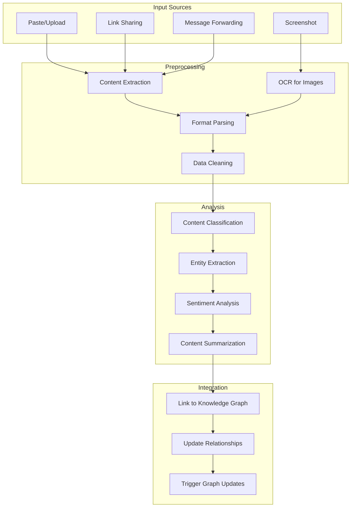

# Multimodal Input Processing for ContextFlow

This document describes how ContextFlow can accept and process various types of input data beyond traditional code and documentation, including images, messages, links, and external content.

## Input Types Supported

### 1. Text-Based Inputs
- **Code snippets** - pasted code fragments
- **Messages** - Slack/Teams/Email conversations
- **Documentation** - README files, wikis, ADRs
- **Links** - URLs to external resources
- **Chat logs** - AI assistant conversations

### 2. Visual Inputs
- **Screenshots** - UI mockups, error messages
- **Diagrams** - architecture diagrams, flowcharts
- **Photos** - whiteboard sketches, handwritten notes

### 3. Structured Data
- **JSON/YAML configs** - configuration files
- **CSV data** - tabular data, test results
- **API responses** - REST/GraphQL responses

### 4. External Links
- **Documentation portals** - Confluence, SharePoint
- **Issue trackers** - Jira, GitHub Issues
- **Knowledge bases** - Stack Overflow, internal wikis

## Input Processing Pipeline



## MCP Tools for Input Processing

### Image Processing Tools
```python
@server.tool()
def process_screenshot(image_data: bytes, context: str = "") -> dict:
    """
    Process screenshot and extract relevant information

    Args:
        image_data: Base64 encoded image data
        context: Optional context about the screenshot

    Returns:
        Extracted text, UI elements, and insights
    """
    # OCR processing
    text_content = extract_text_from_image(image_data)

    # UI element detection
    ui_elements = detect_ui_elements(image_data)

    # Content classification
    content_type = classify_image_content(image_data, text_content)

    # Link to existing knowledge
    related_entities = find_related_entities(text_content, context)

    return {
        "extracted_text": text_content,
        "ui_elements": ui_elements,
        "content_type": content_type,
        "related_entities": related_entities,
        "insights": generate_insights(text_content, ui_elements, content_type)
    }

@server.tool()
def process_diagram(image_data: bytes, diagram_type: str = "architecture") -> dict:
    """
    Process architecture/flow diagrams

    Args:
        image_data: Diagram image
        diagram_type: Type of diagram (architecture, flow, erd, etc.)

    Returns:
        Extracted components and relationships
    """
    # OCR for text elements
    text_elements = extract_diagram_text(image_data)

    # Shape detection
    shapes = detect_shapes(image_data)

    # Connection analysis
    connections = analyze_connections(shapes)

    # Convert to graph structure
    graph_structure = diagram_to_graph(text_elements, shapes, connections)

    return {
        "components": text_elements,
        "relationships": connections,
        "graph_structure": graph_structure,
        "validation": validate_diagram_structure(graph_structure, diagram_type)
    }
```

### Message Processing Tools
```python
@server.tool()
def process_chat_message(message: str, sender: str, channel: str, timestamp: str) -> dict:
    """
    Process chat message and extract knowledge

    Args:
        message: Message content
        sender: Message author
        channel: Chat channel/room
        timestamp: Message timestamp

    Returns:
        Extracted knowledge and relationships
    """
    # Entity extraction
    entities = extract_entities_from_message(message)

    # Intent classification
    intent = classify_message_intent(message)

    # Knowledge extraction
    knowledge_items = extract_knowledge_from_message(message, intent)

    # Link to existing context
    related_context = find_message_context(entities, channel, timestamp)

    return {
        "entities": entities,
        "intent": intent,
        "knowledge_items": knowledge_items,
        "related_context": related_context,
        "action_items": extract_action_items(message)
    }

@server.tool()
def process_email_thread(email_data: dict) -> dict:
    """
    Process email thread and extract decisions/discussions

    Args:
        email_data: Email thread data (subject, body, replies, etc.)

    Returns:
        Extracted decisions, action items, and knowledge
    """
    # Thread analysis
    thread_summary = summarize_email_thread(email_data)

    # Decision extraction
    decisions = extract_decisions_from_emails(email_data)

    # Action item identification
    action_items = identify_action_items(email_data)

    # Stakeholder analysis
    stakeholders = analyze_email_stakeholders(email_data)

    return {
        "thread_summary": thread_summary,
        "decisions": decisions,
        "action_items": action_items,
        "stakeholders": stakeholders,
        "follow_ups": identify_follow_up_needs(email_data)
    }
```

### Link Processing Tools
```python
@server.tool()
def process_documentation_link(url: str, title: str = "", description: str = "") -> dict:
    """
    Process link to documentation and extract content

    Args:
        url: Documentation URL
        title: Optional title
        description: Optional description

    Returns:
        Extracted content and metadata
    """
    # Content fetching
    content = fetch_url_content(url)

    # Content type detection
    content_type = detect_content_type(content, url)

    # Content extraction
    if content_type == "confluence":
        extracted = extract_confluence_content(content)
    elif content_type == "github_wiki":
        extracted = extract_github_wiki_content(content)
    elif content_type == "sharepoint":
        extracted = extract_sharepoint_content(content)
    else:
        extracted = extract_generic_content(content)

    # Knowledge extraction
    knowledge_items = extract_knowledge_from_documentation(extracted)

    # Link to existing knowledge
    related_entities = find_related_entities_in_graph(knowledge_items)

    return {
        "url": url,
        "content_type": content_type,
        "extracted_content": extracted,
        "knowledge_items": knowledge_items,
        "related_entities": related_entities,
        "last_updated": get_content_last_modified(url)
    }

@server.tool()
def process_api_documentation(url: str, api_type: str = "rest") -> dict:
    """
    Process API documentation and extract endpoint information

    Args:
        url: API documentation URL
        api_type: Type of API (rest, graphql, grpc, etc.)

    Returns:
        Extracted API specification
    """
    # Fetch documentation
    content = fetch_url_content(url)

    # Parse API spec
    if api_type == "rest":
        api_spec = parse_openapi_spec(content)
    elif api_type == "graphql":
        api_spec = parse_graphql_schema(content)
    else:
        api_spec = parse_generic_api_doc(content)

    # Extract endpoints
    endpoints = extract_api_endpoints(api_spec)

    # Link to code
    code_references = find_api_usage_in_codebase(endpoints)

    return {
        "api_type": api_type,
        "endpoints": endpoints,
        "data_models": extract_data_models(api_spec),
        "code_references": code_references,
        "deprecation_warnings": identify_deprecated_endpoints(api_spec)
    }
```

## Integration with Knowledge Graph

### Graph Schema Extensions
```cypher
// New node types for multimodal content
(:Image {
  id: "img_123",
  filename: "architecture_diagram.png",
  extracted_text: "User service architecture...",
  ui_elements: ["button", "form", "api_call"],
  uploaded_by: "john.doe",
  uploaded_at: datetime(),
  content_type: "architecture_diagram"
})

(:Message {
  id: "msg_456",
  content: "We decided to use PostgreSQL for user data",
  sender: "architect@example.com",
  channel: "architecture-discussion",
  timestamp: datetime(),
  sentiment: "positive",
  entities: ["PostgreSQL", "user data"],
  intent: "decision_making"
})

(:WebResource {
  url: "https://company.atlassian.net/wiki/spaces/ENG/pages/123456/API+Guidelines",
  title: "API Guidelines",
  content_type: "confluence_page",
  last_crawled: datetime(),
  extracted_content: "...",
  knowledge_items: ["REST API patterns", "error handling"]
})

// New relationship types
(message:Message)-[:MENTIONS]->(entity:CodeEntity)
(image:Image)-[:REPRESENTS]->(component:ArchitectureComponent)
(webResource:WebResource)-[:REFERENCES]->(adr:ADR)
```

### Update Mechanisms
```python
class MultimodalKnowledgeUpdater:
    def __init__(self, neo4j_connection, vector_db):
        self.neo4j = neo4j_connection
        self.vector_db = vector_db

    async def process_image_input(self, image_data: dict):
        """Process image and update knowledge graph"""
        # Extract content
        processed = await self.process_image(image_data)

        # Create graph nodes
        image_node = await self.create_image_node(processed)

        # Link to existing entities
        await self.link_image_to_entities(image_node, processed['related_entities'])

        # Update vector embeddings
        await self.update_vector_embeddings(processed['extracted_text'])

        # Trigger AI insights
        await self.generate_ai_insights(processed)

    async def process_message_input(self, message_data: dict):
        """Process message and update knowledge graph"""
        # Extract knowledge
        processed = await self.process_message(message_data)

        # Create message node
        message_node = await self.create_message_node(processed)

        # Link entities and context
        await self.link_message_entities(message_node, processed['entities'])

        # Update conversation context
        await self.update_conversation_context(message_node, processed['channel'])

        # Extract action items
        await self.create_action_items(processed['action_items'])

    async def process_link_input(self, link_data: dict):
        """Process web link and update knowledge graph"""
        # Fetch and process content
        processed = await self.process_web_content(link_data)

        # Create/update web resource node
        resource_node = await self.create_web_resource_node(processed)

        # Extract and link knowledge
        await self.link_knowledge_items(resource_node, processed['knowledge_items'])

        # Update freshness tracking
        await self.update_content_freshness(resource_node)
```

## User Interface Components

### Input Interface
```typescript
// React component for multimodal input
const MultimodalInput = () => {
  const [inputType, setInputType] = useState('text');

  const handleFileUpload = async (file: File) => {
    if (file.type.startsWith('image/')) {
      const result = await mcpClient.callTool('process_screenshot', {
        image_data: await fileToBase64(file)
      });
      updateKnowledgeGraph(result);
    }
  };

  const handleUrlSubmit = async (url: string) => {
    const result = await mcpClient.callTool('process_documentation_link', {
      url: url
    });
    updateKnowledgeGraph(result);
  };

  const handleMessagePaste = async (message: string) => {
    const result = await mcpClient.callTool('process_chat_message', {
      message: message,
      sender: 'user',
      channel: 'manual_input',
      timestamp: new Date().toISOString()
    });
    updateKnowledgeGraph(result);
  };

  return (
    <div className="multimodal-input">
      <div className="input-tabs">
        <button onClick={() => setInputType('text')}>Text</button>
        <button onClick={() => setInputType('image')}>Image</button>
        <button onClick={() => setInputType('link')}>Link</button>
        <button onClick={() => setInputType('message')}>Message</button>
      </div>

      {inputType === 'text' && (
        <textarea
          placeholder="Paste code, messages, or any text content..."
          onChange={(e) => handleMessagePaste(e.target.value)}
        />
      )}

      {inputType === 'image' && (
        <input
          type="file"
          accept="image/*"
          onChange={(e) => handleFileUpload(e.target.files[0])}
        />
      )}

      {inputType === 'link' && (
        <input
          type="url"
          placeholder="https://..."
          onChange={(e) => handleUrlSubmit(e.target.value)}
        />
      )}
    </div>
  );
};
```

### Content Preview
```typescript
const ContentPreview = ({ processedContent }) => {
  return (
    <div className="content-preview">
      <div className="content-header">
        <h3>{processedContent.title || 'Processed Content'}</h3>
        <span className="content-type">{processedContent.content_type}</span>
      </div>

      {processedContent.extracted_text && (
        <div className="text-content">
          <h4>Extracted Text:</h4>
          <p>{processedContent.extracted_text}</p>
        </div>
      )}

      {processedContent.entities && (
        <div className="entities">
          <h4>Detected Entities:</h4>
          {processedContent.entities.map(entity => (
            <span key={entity} className="entity-tag">{entity}</span>
          ))}
        </div>
      )}

      {processedContent.related_entities && (
        <div className="related-entities">
          <h4>Related in Knowledge Graph:</h4>
          {processedContent.related_entities.map(entity => (
            <div key={entity.id} className="related-entity">
              <span>{entity.name}</span>
              <span className="entity-type">{entity.type}</span>
            </div>
          ))}
        </div>
      )}

      {processedContent.insights && (
        <div className="ai-insights">
          <h4>AI Insights:</h4>
          <ul>
            {processedContent.insights.map((insight, i) => (
              <li key={i}>{insight}</li>
            ))}
          </ul>
        </div>
      )}
    </div>
  );
};
```

## Implementation Examples

### Processing a Screenshot
```python
# User uploads screenshot of error message
result = await mcp_client.process_screenshot(
    image_data=base64_image,
    context="Error when calling user service"
)

# Result contains:
# - extracted_text: "NullPointerException in UserService.getUser()"
# - ui_elements: ["error_dialog", "stack_trace"]
# - related_entities: [UserService class, getUser method]
# - insights: ["This error occurs when user ID is null", "Check input validation"]
```

### Processing a Chat Message
```python
# User pastes Slack message
result = await mcp_client.process_chat_message(
    message="We decided to migrate from MySQL to PostgreSQL for better JSON support",
    sender="tech-lead",
    channel="architecture",
    timestamp="2024-01-15T10:30:00Z"
)

# Result contains:
# - entities: ["MySQL", "PostgreSQL", "JSON support"]
# - intent: "decision_making"
# - knowledge_items: ["Database migration decision", "PostgreSQL benefits"]
# - action_items: ["Update database config", "Migrate schemas"]
```

### Processing a Documentation Link
```python
# User shares Confluence link
result = await mcp_client.process_documentation_link(
    url="https://company.atlassian.net/wiki/spaces/ENG/pages/123456/API+Guidelines",
    title="API Guidelines",
    description="Internal API development standards"
)

# Result contains:
# - content_type: "confluence_page"
# - extracted_content: "REST API patterns, error handling, versioning..."
# - knowledge_items: ["REST API patterns", "error handling standards"]
# - related_entities: [existing API classes, ADR documents]
```

## Quality Assurance

### Content Validation
```python
class ContentValidator:
    def validate_processed_content(self, content: dict) -> dict:
        """Validate quality of processed content"""
        issues = []

        # Check text extraction quality
        if content.get('extracted_text'):
            text_quality = self.assess_text_quality(content['extracted_text'])
            if text_quality < 0.7:
                issues.append("Low text extraction quality")

        # Check entity extraction accuracy
        if content.get('entities'):
            entity_accuracy = self.validate_entities(content['entities'])
            if entity_accuracy < 0.8:
                issues.append("Potential entity extraction errors")

        # Check knowledge linking
        if content.get('related_entities'):
            linking_quality = self.validate_relationships(content['related_entities'])
            if linking_quality < 0.6:
                issues.append("Weak knowledge graph connections")

        return {
            "is_valid": len(issues) == 0,
            "quality_score": self.calculate_overall_quality(content),
            "issues": issues,
            "suggestions": self.generate_improvement_suggestions(issues)
        }
```

### User Feedback Integration
```python
class UserFeedbackSystem:
    def collect_feedback(self, content_id: str, user_rating: int, comments: str):
        """Collect user feedback on processed content"""
        feedback = {
            "content_id": content_id,
            "rating": user_rating,  # 1-5 scale
            "comments": comments,
            "timestamp": datetime.now(),
            "user_context": self.get_user_context()
        }

        # Store feedback
        self.store_feedback(feedback)

        # Update processing models
        self.update_ml_models(feedback)

        # Improve future processing
        self.apply_feedback_learnings(feedback)

    def get_user_context(self):
        """Get context about the user for better feedback analysis"""
        return {
            "user_role": "developer",
            "experience_level": "senior",
            "current_task": "api_design",
            "team_size": 8
        }
```

This multimodal input processing system transforms ContextFlow from a code-focused tool into a comprehensive knowledge management platform that can accept, process, and integrate any form of information that developers encounter in their daily work.