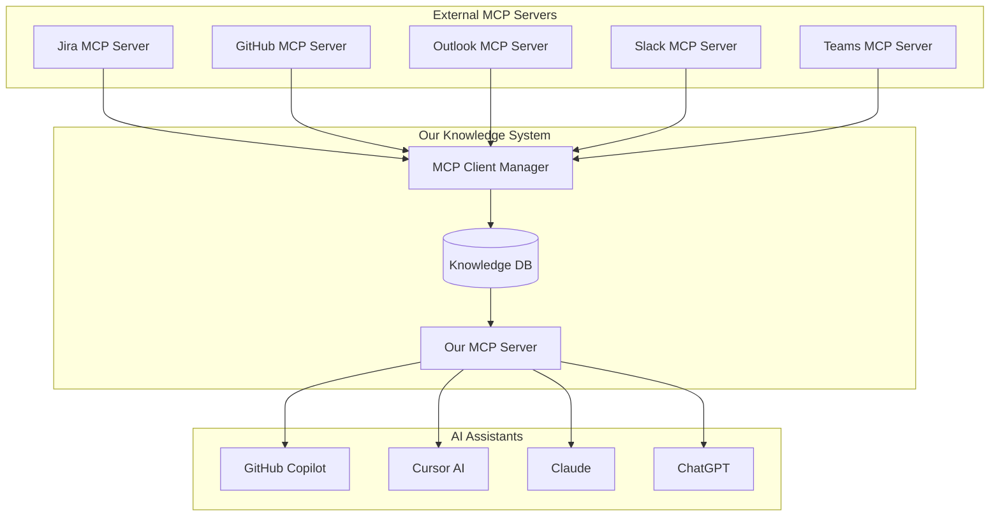

# Pluggable System Architecture & Bidirectional MCP

## Vision: MCP as Universal Integration Layer

### Core Concept
Our system should be both:
1. **MCP Client** - consuming data from various sources via MCP
2. **MCP Server** - providing knowledge to AI assistants via MCP

This creates a "MCP Hub" architecture where our knowledge system sits in the middle, orchestrating information flow.



## Plugin Architecture

### Plugin Types

#### 1. **Issue Tracker Plugins**
```python
class IssueTrackerPlugin:
    def fetch_issues(self, project_id: str) -> List[Issue]:
        pass
    
    def get_issue_context(self, issue_id: str) -> IssueContext:
        pass
    
    def track_issue_changes(self) -> Iterator[IssueUpdate]:
        pass

# Implementations:
# - JiraPlugin (via Jira MCP Server)
# - GitHubIssuesPlugin (via GitHub MCP Server)
# - LinearPlugin (via Linear MCP Server)
# - AzureDevOpsPlugin (via Azure MCP Server)
```

#### 2. **Communication Plugins**
```python
class CommunicationPlugin:
    def fetch_messages(self, channel: str, since: datetime) -> List[Message]:
        pass
    
    def get_thread_context(self, message_id: str) -> ThreadContext:
        pass
    
    def extract_knowledge(self, message: Message) -> List[KnowledgeItem]:
        pass

# Implementations:
# - SlackPlugin (via Slack MCP Server)
# - TeamsPlugin (via Teams MCP Server)
# - DiscordPlugin (via Discord MCP Server)
# - EmailPlugin (via Outlook/Gmail MCP Server)
```

#### 3. **Documentation Plugins**
```python
class DocumentationPlugin:
    def fetch_documents(self, space: str) -> List[Document]:
        pass
    
    def track_document_changes(self) -> Iterator[DocumentUpdate]:
        pass
    
    def get_document_relationships(self, doc_id: str) -> List[Relationship]:
        pass

# Implementations:
# - ConfluencePlugin (via Confluence MCP Server)
# - NotionPlugin (via Notion MCP Server)
# - SharePointPlugin (via SharePoint MCP Server)
# - WikiPlugin (internal or external wikis)
```

#### 4. **Code Repository Plugins**
```python
class RepositoryPlugin:
    def index_repository(self, repo_path: str) -> RepositoryIndex:
        pass
    
    def track_changes(self) -> Iterator[CodeChange]:
        pass
    
    def get_pr_context(self, pr_id: str) -> PRContext:
        pass

# Implementations:
# - GitHubPlugin (via GitHub MCP Server)
# - GitLabPlugin (via GitLab MCP Server)  
# - BitbucketPlugin (via Bitbucket MCP Server)
# - LocalGitPlugin (direct file system access)
```

## Real-World Integration Examples

### Example 1: Email → Knowledge Extraction
```
Scenario: Developer receives email about API deprecation

Flow:
1. OutlookMCP → Our MCP Client → "New email about API deprecation"
2. Our system extracts:
   - Deprecated API: `/api/v1/users`
   - Replacement: `/api/v2/users`
   - Timeline: 6 months
   - Affected services: user-service, auth-service
3. System finds code references to deprecated API
4. Creates knowledge item: "API Migration Required"
5. AI assistants now know about deprecation when suggesting code
```

### Example 2: Slack Conversation → Context Building
```
Scenario: Team discusses implementation approach in Slack

Flow:  
1. SlackMCP → Our MCP Client → "Tech discussion in #backend"
2. Our system extracts:
   - Decision: Use Redis for caching
   - Reasoning: Performance requirements
   - Context: user-profile service
3. Links to related code, documentation, previous decisions
4. AI assistants can now suggest Redis patterns for this service
```

### Example 3: Jira Story → Complete Context
```
Scenario: New story created in Jira

Flow:
1. JiraMCP → Our MCP Client → "New story: Add user preferences"
2. Our system enriches with:
   - Related existing code (User entity, preferences table)
   - Similar past implementations
   - Architectural constraints from ADRs
   - Test patterns from similar features
3. AI assistants get complete context when developer asks for help
```

## Technical Implementation

### MCP Client Manager
```python
class MCPClientManager:
    def __init__(self):
        self.clients = {}
        self.plugins = {}
    
    def register_mcp_server(self, name: str, server_config: MCPServerConfig):
        """Register an external MCP server"""
        client = MCPClient(server_config)
        self.clients[name] = client
    
    def register_plugin(self, name: str, plugin: Plugin):
        """Register a plugin that uses MCP clients"""
        plugin.set_mcp_clients(self.clients)
        self.plugins[name] = plugin
    
    async def collect_data(self):
        """Collect data from all plugins"""
        for plugin in self.plugins.values():
            async for item in plugin.fetch_data():
                await self.process_knowledge_item(item)
```

### Plugin Base Classes
```python
class MCPPlugin:
    def __init__(self, mcp_client_name: str):
        self.mcp_client_name = mcp_client_name
        self.mcp_client = None
    
    def set_mcp_clients(self, clients: Dict[str, MCPClient]):
        self.mcp_client = clients[self.mcp_client_name]
    
    async def fetch_data(self) -> AsyncIterator[KnowledgeItem]:
        """Override in specific plugins"""
        pass

class JiraPlugin(MCPPlugin):
    def __init__(self):
        super().__init__("jira")
    
    async def fetch_data(self) -> AsyncIterator[KnowledgeItem]:
        # Use Jira MCP server to fetch issues
        issues = await self.mcp_client.call_tool("list_issues", {
            "project": "PROJECT_KEY",
            "status": ["In Progress", "To Do"]
        })
        
        for issue in issues:
            yield KnowledgeItem(
                type="jira_issue",
                content=issue,
                relationships=await self._extract_relationships(issue)
            )
```

### Our MCP Server Implementation
```python
from mcp.server import Server

knowledge_server = Server("knowledge-system")

@knowledge_server.tool()
def find_related_code(description: str) -> List[CodeReference]:
    """Find code related to a task description"""
    # Search our knowledge base for related code
    return search_engine.find_code(description)

@knowledge_server.tool()
def get_implementation_context(story_id: str) -> ImplementationContext:
    """Get full context for implementing a story"""
    return {
        "related_code": find_related_code_for_story(story_id),
        "architectural_decisions": find_relevant_adrs(story_id),
        "similar_implementations": find_similar_past_work(story_id),
        "testing_patterns": get_testing_recommendations(story_id)
    }

@knowledge_server.tool()  
def check_impact(proposed_change: str) -> ImpactAnalysis:
    """Analyze impact of proposed code change"""
    return impact_analyzer.analyze(proposed_change)
```

## Configuration System

### Plugin Configuration
```yaml
# config/plugins.yml
plugins:
  jira:
    enabled: true
    mcp_server: "jira-mcp-server"
    config:
      server_url: "https://company.atlassian.net"
      projects: ["BACKEND", "FRONTEND", "API"]
      sync_interval: 300  # 5 minutes
  
  slack:
    enabled: true
    mcp_server: "slack-mcp-server" 
    config:
      workspace: "company-workspace"
      channels: ["#backend", "#architecture", "#incidents"]
      extract_decisions: true
      extract_knowledge: true
  
  outlook:
    enabled: true
    mcp_server: "outlook-mcp-server"
    config:
      folders: ["Inbox", "Architecture"]
      extract_from_senders: ["architects@company.com"]
      keywords: ["deprecation", "migration", "decision"]

mcp_servers:
  jira-mcp-server:
    command: "node"
    args: ["jira-mcp-server/dist/index.js"]
    env:
      JIRA_URL: "${JIRA_URL}"
      JIRA_TOKEN: "${JIRA_TOKEN}"
  
  slack-mcp-server:
    command: "python"
    args: ["-m", "slack_mcp_server"]
    env:
      SLACK_TOKEN: "${SLACK_BOT_TOKEN}"
```

## Privacy and Security Considerations

### Data Classification
```python
class DataClassifier:
    def classify_content(self, content: str, source: str) -> SecurityLevel:
        """Classify content sensitivity"""
        if self.contains_credentials(content):
            return SecurityLevel.SECRET
        elif self.contains_personal_info(content):
            return SecurityLevel.CONFIDENTIAL
        elif source in ["public-channels", "documentation"]:
            return SecurityLevel.PUBLIC
        else:
            return SecurityLevel.INTERNAL

class PrivacyFilter:
    def should_index(self, item: KnowledgeItem) -> bool:
        """Determine if item should be indexed"""
        level = self.classifier.classify_content(item.content, item.source)
        return level in self.allowed_levels
    
    def sanitize_content(self, content: str) -> str:
        """Remove sensitive information"""
        # Remove emails, tokens, personal info
        return self.sanitizer.clean(content)
```

## Implementation Roadmap

### Phase 1: Core Plugin System (2-3 weeks)
- [ ] Basic plugin architecture
- [ ] MCP client manager
- [ ] Simple Jira plugin via MCP
- [ ] Our basic MCP server

### Phase 2: Communication Plugins (2-3 weeks)  
- [ ] Slack plugin via MCP
- [ ] Email plugin (Outlook/Gmail) via MCP
- [ ] Knowledge extraction algorithms
- [ ] Privacy filtering system

### Phase 3: Advanced Features (3-4 weeks)
- [ ] Teams plugin via MCP  
- [ ] Documentation plugins (Confluence, Notion)
- [ ] Advanced context correlation
- [ ] Real-time synchronization

### Phase 4: Production Features (2-3 weeks)
- [ ] Performance optimizations
- [ ] Error handling and resilience
- [ ] Monitoring and observability
- [ ] Configuration management

## Benefits of This Approach

### 1. **Ecosystem Integration**
- Leverages existing MCP servers (many already exist)
- Creates network effects - more MCP servers = more value
- Standardized integration patterns

### 2. **Flexibility**
- Easy to add new data sources
- Plugins can be developed independently  
- Different organizations can customize plugin sets

### 3. **Privacy Control**
- Data classification and filtering
- Local processing of sensitive information
- Granular control over what gets indexed

### 4. **Developer Experience**
- AI assistants get richer context automatically
- No manual copying of information
- Seamless integration with existing workflows

Ten approach z pluggable system i dwukierunkowym MCP znacznie rozszerza możliwości systemu i czyni go naprawdę użytecznym w rzeczywistych organizacjach!