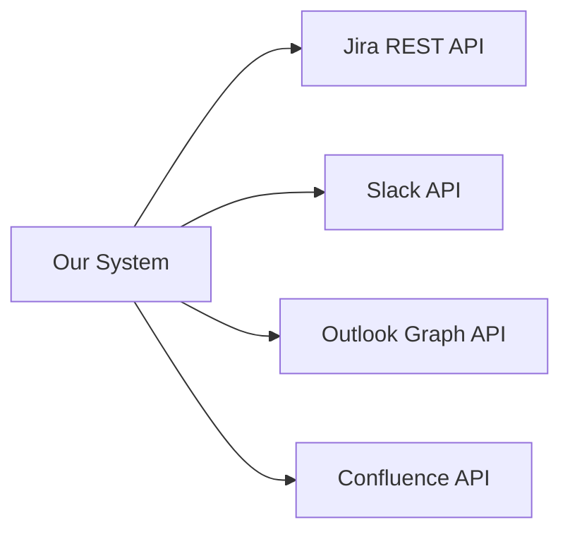
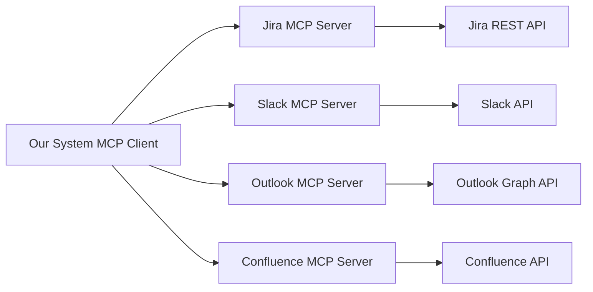
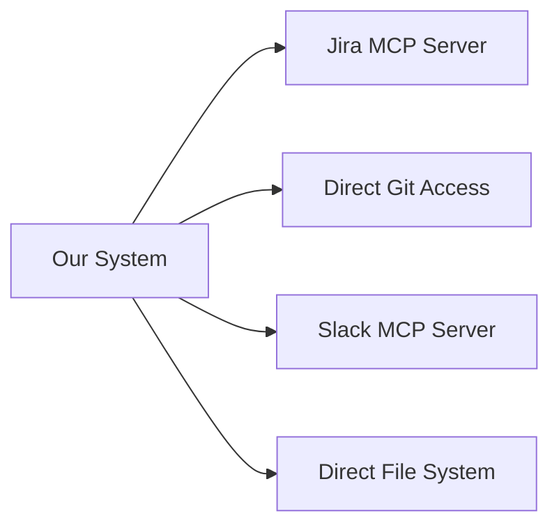

# Integration Comparison Matrix

## Integration Approaches Comparison

### Option 1: Direct API Integration


**Pros:**
- Direct control over API calls
- Maximum performance (no middleman)
- Custom rate limiting and caching

**Cons:**
- Need to learn each API individually
- Different authentication methods for each
- Handle rate limits, pagination, webhooks separately
- Maintenance burden when APIs change
- No standardization

### Option 2: MCP-Based Integration (Recommended)


**Pros:**
- Standardized interface (MCP protocol)
- Leverage existing MCP servers from community
- Consistent error handling and authentication patterns
- Easy to add new integrations
- Plugin-based architecture

**Cons:**
- Depends on availability of MCP servers
- Additional layer of abstraction
- Potential performance overhead

### Option 3: Hybrid Approach


**Pros:**
- Best of both worlds
- Direct access for local resources (Git, files)
- MCP for remote services
- Flexibility based on data source characteristics

**Cons:**
- More complex architecture
- Different patterns for different integrations
- Higher development effort

## Data Source Prioritization

### Tier 1: Core Development (MVP)
| Source | Priority | Integration | Effort | Value |
|--------|----------|-------------|--------|-------|
| **Local Git repos** | HIGH | Direct FS | LOW | HIGH |
| **Java/Kotlin code** | HIGH | Tree-sitter | MEDIUM | HIGH |  
| **Config files** (.yml, .properties) | HIGH | Direct parsing | LOW | HIGH |
| **HTTP test files** | HIGH | RegEx patterns | LOW | MEDIUM |

### Tier 2: Project Management
| Source | Priority | Integration | Effort | Value |
|--------|----------|-------------|--------|-------|
| **Jira** | HIGH | MCP Server | MEDIUM | HIGH |
| **GitHub Issues** | MEDIUM | MCP Server | LOW | MEDIUM |
| **Linear** | LOW | MCP Server | MEDIUM | LOW |

### Tier 3: Communication
| Source | Priority | Integration | Effort | Value |
|--------|----------|-------------|--------|-------|
| **Slack** | HIGH | MCP Server | MEDIUM | MEDIUM |
| **Email** (Outlook) | MEDIUM | MCP Server | HIGH | MEDIUM |
| **Teams** | MEDIUM | MCP Server | HIGH | LOW |
| **Discord** | LOW | MCP Server | MEDIUM | LOW |

### Tier 4: Documentation
| Source | Priority | Integration | Effort | Value |
|--------|----------|-------------|--------|-------|
| **Confluence** | MEDIUM | MCP Server | MEDIUM | MEDIUM |
| **Notion** | LOW | MCP Server | MEDIUM | LOW |
| **SharePoint** | LOW | MCP Server | HIGH | LOW |
| **Local Markdown** | HIGH | Direct FS | LOW | HIGH |

## Privacy & Security Comparison

### Local vs Remote Data Sources

#### Local Sources (High Privacy)
- **Git repositories**: Full control, no external access
- **Configuration files**: Local processing only
- **Local documentation**: Complete privacy

#### Remote Sources (Privacy Considerations)
- **Jira**: Organization data, requires API access
- **Slack**: Conversation history, sensitive discussions
- **Email**: High privacy concerns, personal information
- **Confluence**: Documentation, some public/internal mix

### Data Classification Strategy

```python
class DataSource:
    CLASSIFICATION = {
        # Local sources - full trust
        "local_git": SecurityLevel.TRUSTED,
        "config_files": SecurityLevel.TRUSTED,
        "local_docs": SecurityLevel.TRUSTED,
        
        # Organizational sources - filtered
        "jira": SecurityLevel.ORGANIZATIONAL, 
        "confluence": SecurityLevel.ORGANIZATIONAL,
        "github": SecurityLevel.ORGANIZATIONAL,
        
        # Communication - high filtering
        "slack": SecurityLevel.SENSITIVE,
        "email": SecurityLevel.SENSITIVE,
        "teams": SecurityLevel.SENSITIVE,
    }
```

## Implementation Priority Matrix

### Phase 1 Implementation Priority
```
High Value, Low Effort (MVP):
- Local Git repositories ⭐⭐⭐⭐⭐
- Java/Kotlin parsing ⭐⭐⭐⭐⭐
- Configuration files ⭐⭐⭐⭐⭐
- Basic Jira integration ⭐⭐⭐⭐

Medium Value, Low Effort (Early):  
- HTTP test files ⭐⭐⭐
- Local Markdown docs ⭐⭐⭐
- GitHub Issues ⭐⭐⭐

High Value, High Effort (Later):
- Slack integration ⭐⭐⭐⭐
- Email integration ⭐⭐⭐⭐
- Cross-file dependency tracking ⭐⭐⭐⭐⭐
```

## Technical Implementation Comparison

### MCP Server Development vs Using Existing

#### Build Our Own MCP Servers
**Pros:**
- Complete control over functionality
- Custom optimizations for our use case
- No dependency on external projects

**Cons:**
- High development effort (2-3 weeks per server)
- Need to maintain and update
- Duplicate work if community servers exist

#### Use Existing MCP Servers
**Pros:**
- Faster time to market
- Community maintenance and updates
- Standard functionality

**Cons:**
- Limited customization
- Dependency on external projects
- May not have all features we need

### Recommended Approach
1. **Use existing MCP servers** where available and suitable
2. **Build custom MCP servers** for specialized needs
3. **Contribute back** improvements to community servers
4. **Direct integration** for local/simple sources

## Integration Testing Strategy

### Test Data Sources
```yaml
test_data_sources:
  jira:
    mock_server: true
    sample_issues: 100
    projects: ["TEST", "DEMO"]
    
  slack:
    mock_conversations: true
    channels: ["#test-channel"]  
    message_count: 500
    
  git_repos:
    sample_repos: 
      - "test-java-project"
      - "test-spring-boot"
    commits: last_30_days
    
  email:
    mock_emails: true
    folders: ["Test Architecture"]
    count: 50
```

### Integration Test Scenarios
1. **Data Collection**: Can we fetch data from each source?
2. **Knowledge Extraction**: Are we extracting useful information?
3. **Cross-Reference**: Can we link information between sources?
4. **Privacy Filtering**: Are sensitive items properly filtered?
5. **Performance**: How long does full sync take?

## Decision Matrix

### Final Recommendations

| Integration Type | Recommended Approach | Timeline | Risk |
|------------------|---------------------|----------|------|
| **Local Code** | Direct filesystem + Tree-sitter | Week 1-2 | LOW |
| **Configuration** | Direct parsing | Week 1-2 | LOW |
| **Jira** | Existing MCP server | Week 3-4 | MEDIUM |
| **GitHub** | Existing MCP server | Week 3-4 | LOW |
| **Slack** | Custom MCP server | Week 5-6 | MEDIUM |
| **Email** | Custom MCP server | Week 7-8 | HIGH |
| **Confluence** | Existing MCP server | Week 9-10 | MEDIUM |

### Success Criteria
- [ ] Can index 10k+ files in under 5 minutes
- [ ] Can find cross-file dependencies with 95% accuracy  
- [ ] Can integrate with at least 3 external data sources
- [ ] Privacy filtering blocks 100% of credentials/PII
- [ ] AI assistants get contextual information within 1 second

Ten approach z pluggable system daje nam ogromną elastyczność i możliwość stopniowego rozwijania integracji z różnymi źródłami danych!