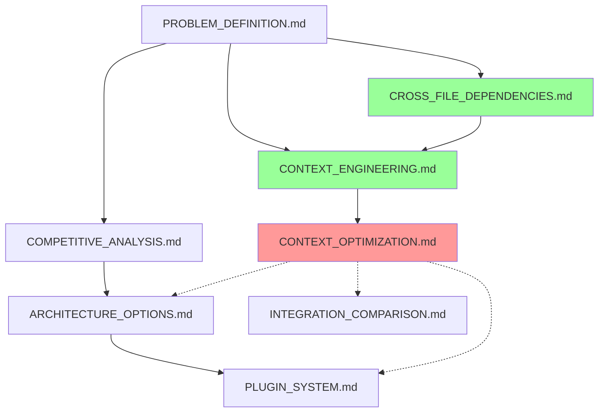

# Documentation Consistency Analysis (Meta-Problem)

## The Meta-Problem We're Experiencing

**Ironic situation**: While designing a Context Engineering system to solve documentation drift, our own research documents are experiencing the same issue.

### Observable Symptoms in Our Project
```
research/
├── PROBLEM_DEFINITION.md          # Written first, may be outdated
├── CROSS_FILE_DEPENDENCIES.md     # Core problem, should drive architecture
├── CONTEXT_ENGINEERING.md         # New main concept, changes everything
├── CONTEXT_OPTIMIZATION.md        # Critical addition, affects all plans
├── ARCHITECTURE_OPTIONS.md        # May need major updates
├── PLUGIN_SYSTEM.md               # May conflict with optimization needs
└── INTEGRATION_COMPARISON.md      # Priorities may have shifted
```

### Potential Inconsistencies to Check

#### 1. **Architecture vs Context Optimization**
**Question**: Does our recommended architecture (MCP Hub with Progressive Complexity) align with Context Optimization requirements?

**Potential conflict**: 
- Architecture doc suggests loading all plugins progressively
- Context Optimization suggests dynamic loading based on query type
- Which approach wins?

#### 2. **Problem Priority Shifts**
**Original priority** (from PROBLEM_DEFINITION.md):
1. Context switching overhead
2. Knowledge fragmentation  
3. AI assistant limitations
4. Documentation decay

**Current priority** (implied by recent additions):
1. Context bloat (new #1 problem)
2. Cross-file dependencies (concrete example)
3. Plugin integration (architecture focus)
4. Original problems (may be less important now)

#### 3. **Technology Stack Conflicts**
**ARCHITECTURE_OPTIONS.md** recommends:
- Phase 1: SQLite → Phase 4: Neo4j
- Progressive complexity increase

**CONTEXT_OPTIMIZATION.md** suggests:
- Immediate need for sophisticated context classification
- Dynamic tool loading from day 1
- May require more complex architecture earlier

#### 4. **Success Metrics Inconsistency**
Different documents define different success criteria:
- PROBLEM_DEFINITION.md: Time to find information (80% reduction)
- CONTEXT_OPTIMIZATION.md: Context size reduction (60-70%)
- INTEGRATION_COMPARISON.md: Various performance metrics

Which metrics actually matter most?

## Documentation Consistency Analysis

### Current Document Relationships


**Red = Potential conflicts with earlier docs**
**Green = Core concepts that should drive other docs**

### Consistency Check Results

#### ✅ **Consistent Elements**
1. **Core problem identification**: Cross-file dependencies remain central
2. **MCP protocol usage**: All documents align on MCP as integration method
3. **Local-first approach**: Privacy requirements consistent across docs
4. **Plugin architecture**: Generally consistent vision

#### ⚠️ **Inconsistent Elements**
1. **Implementation timeline**: 
   - ARCHITECTURE_OPTIONS: 2-3 weeks per phase
   - CONTEXT_OPTIMIZATION: Suggests more complexity needed earlier
   
2. **Technology choices**:
   - SQLite first vs immediate need for sophisticated context management
   - Simple file watching vs complex query classification
   
3. **Problem priority**:
   - Original focus on knowledge fragmentation
   - New focus on context optimization
   
4. **Success metrics**:
   - Multiple different KPIs across documents
   - No unified measurement framework

## Resolution Strategy

### 1. **Establish Document Hierarchy**
```
Tier 1 - Core Concepts (Drive everything else):
├── CONTEXT_ENGINEERING.md           # Main value proposition
└── CROSS_FILE_DEPENDENCIES.md       # Concrete problem example

Tier 2 - Implementation Strategy (Derived from Tier 1):
├── CONTEXT_OPTIMIZATION.md          # Critical requirement
├── ARCHITECTURE_OPTIONS.md          # Updated based on optimization needs
└── PLUGIN_SYSTEM.md                 # Updated for dynamic loading

Tier 3 - Analysis & Comparison (Supporting):
├── PROBLEM_DEFINITION.md            # Historical context
├── COMPETITIVE_ANALYSIS.md          # Market positioning  
└── INTEGRATION_COMPARISON.md        # Technical choices
```

### 2. **Reconciliation Actions Needed**

#### A. Update Architecture Options
```bash
# Update ARCHITECTURE_OPTIONS.md to reflect:
# - Context optimization as Phase 1 requirement
# - Dynamic tool loading from start
# - Reconcile with plugin system needs
```

#### B. Consolidate Success Metrics
```bash
# Create unified metrics framework addressing:
# - Context optimization metrics (primary)
# - Cross-file dependency accuracy (primary)  
# - Knowledge discovery metrics (secondary)
# - Performance metrics (infrastructure)
```

#### C. Update Implementation Timeline
```bash
# Realistic timeline considering:
# - Context optimization complexity
# - Dynamic loading requirements
# - Plugin system architecture
```

### 3. **Documentation Maintenance Strategy**

#### Implement Our Own Solution
Use this as a testing ground for our Context Engineering approach:

```python
# Example: Documentation consistency checker
class DocumentationConsistency:
    def check_concept_alignment(self, documents: List[Document]) -> ConsistencyReport:
        """Check if core concepts are consistently defined across docs"""
        core_concepts = ["Context Engineering", "Cross-file Dependencies", "MCP Hub"]
        
        inconsistencies = []
        for concept in core_concepts:
            definitions = [doc.extract_concept_definition(concept) for doc in documents]
            if not self.are_definitions_consistent(definitions):
                inconsistencies.append({
                    "concept": concept,
                    "conflicting_docs": self.find_conflicting_docs(definitions),
                    "suggested_resolution": self.suggest_resolution(definitions)
                })
        
        return ConsistencyReport(inconsistencies)
    
    def check_timeline_consistency(self, arch_doc: Document, other_docs: List[Document]):
        """Check if implementation timelines are realistic and consistent"""
        pass
    
    def check_metrics_alignment(self, docs: List[Document]):
        """Ensure success metrics are aligned across documents"""  
        pass
```

## Immediate Actions Required

### 1. **Document Review Session** (Next 2-3 hours)
- [ ] Re-read all documents with fresh perspective
- [ ] Identify specific conflicts and inconsistencies  
- [ ] Note outdated assumptions or requirements
- [ ] List documents that need updates

### 2. **Core Concepts Consolidation** (1 day)
- [ ] Update CONTEXT_ENGINEERING.md as single source of truth
- [ ] Ensure CROSS_FILE_DEPENDENCIES.md aligns with main vision
- [ ] Update CONTEXT_OPTIMIZATION.md priorities

### 3. **Architecture Reconciliation** (1-2 days)
- [ ] Reconcile ARCHITECTURE_OPTIONS with optimization requirements
- [ ] Update PLUGIN_SYSTEM for dynamic loading approach
- [ ] Ensure INTEGRATION_COMPARISON reflects current priorities

### 4. **Metrics Unification** (Half day)
- [ ] Create single success metrics framework
- [ ] Align all documents with unified KPIs
- [ ] Remove conflicting success criteria

## Meta-Lesson for Our Product

This experience demonstrates exactly why our Context Engineering platform is needed:

1. **Documentation drift happens naturally** as projects evolve
2. **Context grows and becomes inconsistent** without active management
3. **Cross-document dependencies** create update complexity
4. **Manual consistency checking is tedious** and error-prone

**Our product should solve this exact problem** - not just for code, but for all project documentation, decisions, and requirements.

## Success Criteria for This Meta-Analysis

- [ ] All documents tell consistent story
- [ ] No conflicting architecture recommendations  
- [ ] Unified success metrics across all docs
- [ ] Clear implementation priority order
- [ ] Realistic timelines that account for all requirements

This meta-problem perfectly validates our product vision and gives us a concrete test case for our own Context Engineering approach!