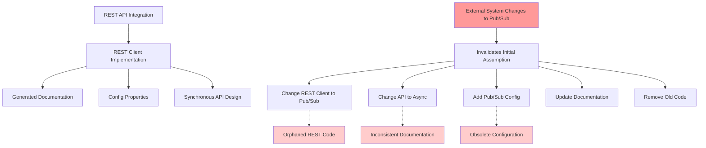
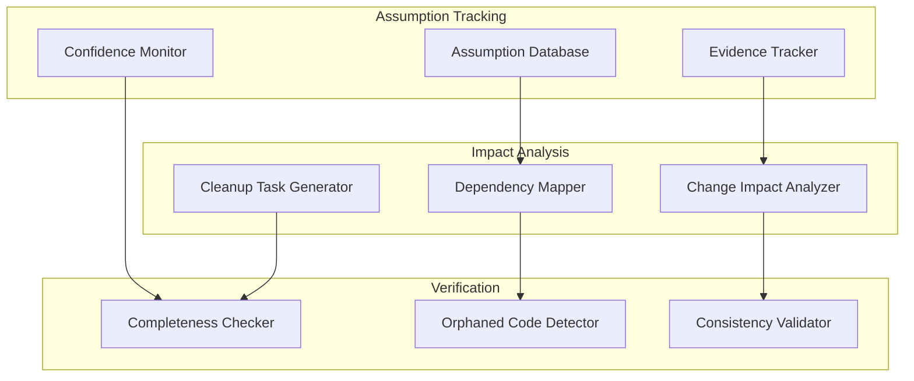

# Assumption Invalidation: When Requirements Change Mid-Implementation

## The Problem: Assumption Invalidation Cascade

### Real-World Scenario
```
Initial Assumption:
✅ "Integrate with External System via REST API"
✅ Request/Response samples provided
✅ Implementation started with REST client

Reality Check (Mid-Development):
❌ API is in preview, requests take 30+ seconds
❌ External team switches to async pub/sub
❌ My API must become async too
❌ Need new config properties (topics, subscriptions)
❌ Old REST client code must be removed
❌ Documentation/README needs major updates
❌ AI-generated code is complex, hard to verify completeness
```

### The Cascade Effect


## Types of Assumption Invalidation

### 1. **External Dependencies Change**
- **API Changes**: REST → Pub/Sub, GraphQL → REST, versioning
- **Infrastructure Changes**: Cloud provider switch, network topology
- **Third-party Updates**: Library breaking changes, service deprecation
- **Integration Protocol Changes**: Sync → Async, polling → webhooks

### 2. **Performance Reality Gap**
- **Assumption**: API will be fast enough
- **Reality**: 30-second response times unacceptable
- **Cascade**: Architecture must change to async patterns

### 3. **Business Requirements Evolution** 
- **Assumption**: Simple request/response sufficient
- **Reality**: Need event sourcing, audit trails, replay capability
- **Cascade**: Data models, persistence, API design all change

### 4. **Scale Reality Check**
- **Assumption**: Current solution will scale
- **Reality**: Performance bottlenecks at production scale
- **Cascade**: Caching, database sharding, microservices split

## AI-Generated Code Complexity Problem

### The "AI Code Verification Challenge"
```python
# AI generates comprehensive implementation
class ExternalServiceClient:
    """
    Complete REST client with:
    - Connection pooling
    - Retry logic with exponential backoff
    - Circuit breaker pattern
    - Comprehensive error handling
    - Metrics collection
    - Health checks
    - Configuration validation
    - Logging integration
    """
    
    def __init__(self, config: ExternalServiceConfig):
        # 50+ lines of initialization code
        # Multiple complex patterns
        # Hard to verify completeness when requirements change
```

**Human verification challenges:**
- Too much code to manually review
- Complex patterns hard to understand quickly
- Difficult to identify what needs removal vs update
- Documentation may not reflect actual implementation
- Configuration spread across multiple files

## Impact of Assumption Invalidation

### Development Time Impact
- **Initial Implementation**: 3-5 days
- **Assumption Invalidation**: +2-3 days for redesign
- **Code Cleanup**: +1-2 days to remove obsolete code
- **Documentation Update**: +1 day
- **Testing New Approach**: +2-3 days
- **Total**: 9-14 days (vs. 3-5 if assumptions were correct)

### Quality Impact
- **Orphaned Code**: Old REST client remains in codebase
- **Configuration Drift**: Multiple config approaches coexist
- **Documentation Lag**: README describes old approach
- **Test Coverage**: Tests for removed functionality remain
- **Deployment Issues**: Old config properties cause confusion

### Team Coordination Impact
- **Context Loss**: Team members lose track of current approach
- **Decision Rationale**: Why changes were made gets lost
- **Implementation History**: Evolution of solution unclear
- **Knowledge Transfer**: New team members confused by mixed patterns

## How Our Context Engineering System Would Solve This

### 1. **Assumption Tracking**
```python
@mcp_tool
def track_assumption(self, assumption: str, evidence: str, confidence: float) -> AssumptionRecord:
    """Track architectural assumptions with evidence and confidence levels"""
    return {
        "assumption": assumption,
        "evidence": evidence,
        "confidence": confidence,
        "date_recorded": datetime.now(),
        "related_code": self.find_dependent_code(assumption),
        "related_docs": self.find_dependent_docs(assumption),
        "related_config": self.find_dependent_config(assumption)
    }

@mcp_tool
def invalidate_assumption(self, assumption_id: str, reason: str) -> InvalidationImpact:
    """Analyze impact of assumption invalidation"""
    assumption = self.get_assumption(assumption_id)
    
    return {
        "affected_files": self.find_files_based_on_assumption(assumption),
        "orphaned_code": self.identify_code_to_remove(assumption),
        "config_changes": self.identify_config_changes_needed(assumption),
        "documentation_updates": self.identify_docs_to_update(assumption),
        "test_changes": self.identify_tests_to_update(assumption)
    }
```

### 2. **Change Impact Analysis**
```python
@mcp_tool
def analyze_architectural_change(self, old_approach: str, new_approach: str) -> ChangeImpact:
    """Comprehensive analysis of architectural changes"""
    
    return {
        "code_changes": {
            "files_to_modify": self.find_files_to_modify(old_approach, new_approach),
            "files_to_remove": self.find_files_to_remove(old_approach),
            "files_to_create": self.estimate_new_files_needed(new_approach)
        },
        "configuration_changes": {
            "properties_to_add": self.identify_new_properties(new_approach),
            "properties_to_remove": self.identify_obsolete_properties(old_approach),
            "properties_to_modify": self.identify_modified_properties(old_approach, new_approach)
        },
        "documentation_impact": {
            "readme_sections": self.find_readme_sections_to_update(),
            "api_docs": self.find_api_docs_to_update(),
            "architecture_docs": self.find_arch_docs_to_update()
        },
        "cleanup_tasks": self.generate_cleanup_checklist(old_approach)
    }
```

### 3. **Implementation Completeness Tracking**
```python
@mcp_tool  
def verify_change_completeness(self, change_id: str) -> CompletenessReport:
    """Verify that all aspects of architectural change were completed"""
    
    change = self.get_change_record(change_id)
    
    return {
        "completed_tasks": self.check_completed_tasks(change),
        "remaining_tasks": self.identify_remaining_tasks(change),
        "orphaned_artifacts": self.find_orphaned_artifacts(change),
        "consistency_issues": self.check_consistency_issues(change),
        "recommendations": self.generate_completion_recommendations(change)
    }
```

## Solution Architecture

### Assumption Management Layer


## Practical Implementation

### 1. **Assumption Documentation Pattern**
```yaml
# assumptions.yml
assumptions:
  external_api_performance:
    description: "External API responses within 2 seconds"
    confidence: 0.7
    evidence: 
      - "API documentation claims sub-second response"
      - "No load testing performed yet"
    dependent_code:
      - "src/external/RestClient.java"
      - "src/service/SynchronousService.java"
    dependent_config:
      - "application.yml:external.api.timeout"
    dependent_docs:
      - "README.md:Integration section"
      - "docs/api-integration.md"
```

### 2. **Change Tracking Pattern**
```yaml
# changes.yml  
changes:
  rest_to_pubsub_migration:
    date: "2024-01-15"
    reason: "External API performance issues"
    old_assumption: "external_api_performance"
    new_approach: "async_pubsub_integration"
    
    completed_tasks:
      - "Implement pub/sub client"
      - "Add async API endpoints"
      - "Update configuration"
    
    remaining_tasks:
      - "Remove REST client code"
      - "Update README documentation"
      - "Remove obsolete tests"
    
    verification_checklist:
      - "No references to RestClient remain"
      - "All sync endpoints converted to async"
      - "Documentation reflects pub/sub approach"
```

### 3. **AI Assistant Integration**
```python
@mcp_tool
def suggest_cleanup_after_change(self, change_id: str) -> CleanupSuggestions:
    """AI-powered suggestions for cleanup after architectural change"""
    
    change = self.get_change_record(change_id)
    codebase = self.analyze_current_codebase()
    
    return {
        "files_to_review": self.identify_files_for_manual_review(change, codebase),
        "safe_to_remove": self.identify_safe_removals(change, codebase),
        "potential_orphans": self.identify_potential_orphans(change, codebase),
        "configuration_cleanup": self.suggest_config_cleanup(change, codebase),
        "documentation_updates": self.suggest_doc_updates(change, codebase)
    }
```

## Implementation Strategy

### Phase 1: Assumption Tracking (2-3 weeks)
- [ ] Build assumption recording system
- [ ] Integrate with documentation
- [ ] Track code dependencies on assumptions
- [ ] Basic impact analysis

### Phase 2: Change Impact Analysis (3-4 weeks)  
- [ ] Dependency mapping algorithms
- [ ] Change cascade analysis
- [ ] Cleanup task generation
- [ ] Integration with MCP tools

### Phase 3: Verification & Cleanup (2-3 weeks)
- [ ] Orphaned code detection
- [ ] Completeness verification
- [ ] Consistency checking
- [ ] Cleanup automation

## Success Metrics

- **Assumption Accuracy**: Track how often assumptions hold vs. get invalidated
- **Change Completeness**: % of changes where all cleanup tasks are completed
- **Orphaned Code Reduction**: Reduce orphaned code by 80%
- **Documentation Consistency**: Keep docs in sync with implementation reality
- **Change Time Reduction**: Reduce time for architectural changes by 40%

This problem is perfect dla naszego Context Engineering systemu - to dokładnie ten typ sytuacji gdzie traditional tools zawodzą, a comprehensive context management może dramatically poprawić development experience.