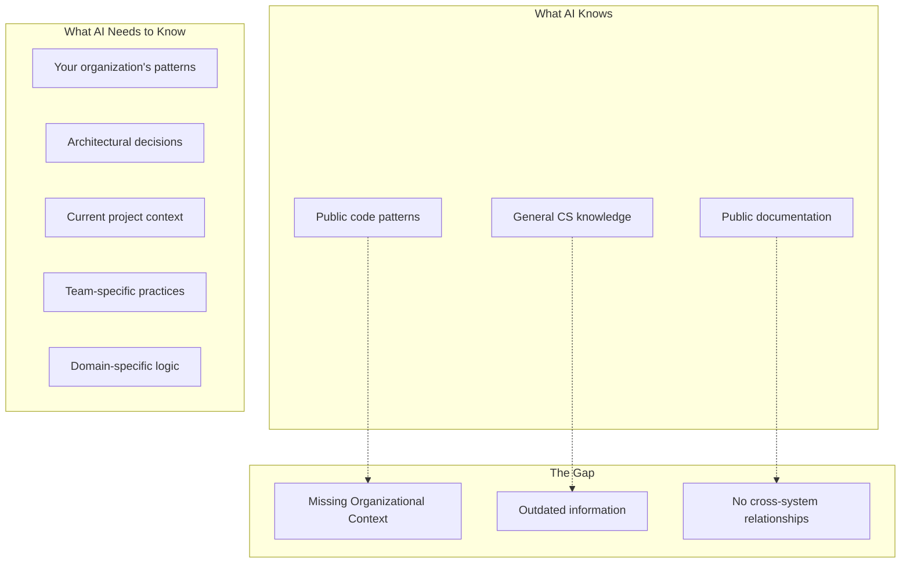

# Context Engineering: The Core Value Proposition

## What is Context Engineering?

**Context Engineering** is the systematic design, collection, curation, and delivery of relevant contextual information to AI systems to improve their decision-making and output quality in specific domains.

For software development, it means providing AI assistants with:
- **Organizational knowledge** (architectural decisions, best practices, constraints)
- **Project context** (current implementations, related code, dependencies)
- **Historical context** (past decisions, lessons learned, evolution)
- **Real-time context** (current discussions, recent changes, active issues)

## Why Current AI Assistants Fail at Context

### The Context Gap


### Examples of Context Engineering in Action

#### Example 1: Story Implementation Context
**Without Context Engineering:**
```
Developer: "Help me implement user preferences feature"
AI: "Here's a generic user preferences implementation using standard patterns..."
```

**With Context Engineering:**
```
Developer: "Help me implement user preferences feature"
AI: "Based on your codebase context:

1. EXISTING PATTERNS:
   - Your User entity already has a preferences JSON column
   - Similar feature in NotificationPreferences (see UserService.java:142)
   - Team uses Builder pattern for complex entities

2. ARCHITECTURAL CONSTRAINTS:
   - ADR-015: Use PostgreSQL JSONB for flexible schemas
   - Must integrate with existing audit logging (AuditableEntity)
   - Follow established validation patterns (PreferencesValidator)

3. RELATED WORK:
   - Jira story BACKEND-234 (similar preferences implementation)
   - Recent Slack discussion about preferences caching strategy
   - Email from architect about preferences performance requirements

4. SUGGESTED IMPLEMENTATION:
   - Extend existing User.preferences structure
   - Use established PreferencesService pattern
   - Add validation following team conventions
   - Update related HTTP test files in user-api.http"
```

#### Example 2: Cross-File Dependency Context
**Without Context Engineering:**
```
Developer: "Change this property name from 'email' to 'emailAddress'"
AI: [Changes only the current file]
```

**With Context Engineering:**
```
Developer: "Change this property name from 'email' to 'emailAddress'"
AI: "This change affects 7 files across your codebase:

IMMEDIATE IMPACT:
- User.java:23 (@Column annotation)
- UserDto.java:15 (field name)
- UserRepository.java:45 (query parameter)

CONFIGURATION IMPACT:
- application.yml:67 (validation message key)
- ValidationMessages.properties:12 (message text)

TEST IMPACT:
- UserTest.java:34 (test data setup)
- user-requests.http:8 (API test request body)

Would you like me to prepare a complete changeset for all affected files?"
```

## Context Engineering Architecture

### Context Collection Layer
```python
class ContextCollector:
    """Collects context from various sources"""
    
    def collect_code_context(self, file_path: str) -> CodeContext:
        """Extract context from code files"""
        return {
            "dependencies": self.find_dependencies(file_path),
            "patterns": self.identify_patterns(file_path),
            "conventions": self.analyze_conventions(file_path)
        }
    
    def collect_project_context(self, project_id: str) -> ProjectContext:
        """Extract context from project management systems"""
        return {
            "current_stories": self.get_active_stories(project_id),
            "team_decisions": self.get_recent_decisions(project_id),
            "architectural_constraints": self.get_adrs(project_id)
        }
    
    def collect_communication_context(self, timeframe: str) -> CommunicationContext:
        """Extract context from team communications"""
        return {
            "recent_discussions": self.get_relevant_discussions(timeframe),
            "decisions": self.extract_decisions_from_comms(timeframe),
            "knowledge_items": self.extract_knowledge(timeframe)
        }
```

### Context Curation Layer
```python
class ContextCurator:
    """Curates and prioritizes context for specific queries"""
    
    def curate_for_query(self, query: str, user_context: UserContext) -> CuratedContext:
        """Select most relevant context for a specific query"""
        raw_context = self.collect_all_context()
        
        return {
            "primary_context": self.rank_by_relevance(raw_context, query),
            "supporting_context": self.find_related_context(query),
            "constraints": self.identify_constraints(query, user_context),
            "anti_patterns": self.identify_anti_patterns(query)
        }
    
    def prioritize_context(self, contexts: List[Context], query: str) -> List[Context]:
        """Prioritize context based on relevance, freshness, and reliability"""
        scores = []
        for context in contexts:
            score = (
                self.relevance_score(context, query) * 0.4 +
                self.freshness_score(context) * 0.3 +
                self.reliability_score(context) * 0.2 +
                self.user_preference_score(context) * 0.1
            )
            scores.append((context, score))
        
        return [context for context, score in sorted(scores, reverse=True)]
```

### Context Delivery Layer
```python
class ContextDelivery:
    """Delivers context to AI systems via MCP protocol"""
    
    @mcp_tool
    def get_implementation_context(self, description: str) -> ImplementationContext:
        """Provide context for implementing a feature"""
        context = self.curator.curate_for_query(description, self.current_user)
        
        return {
            "existing_patterns": context.get_similar_implementations(),
            "architectural_decisions": context.get_relevant_adrs(),
            "team_conventions": context.get_coding_standards(),
            "related_work": context.get_related_stories_and_discussions(),
            "suggested_approach": context.generate_approach_suggestion()
        }
    
    @mcp_tool
    def analyze_change_impact(self, proposed_change: str) -> ImpactAnalysis:
        """Analyze the impact of a proposed change"""
        return self.impact_analyzer.analyze_with_context(
            proposed_change, 
            self.get_full_system_context()
        )
```

## Types of Context We Engineer

### 1. **Structural Context**
- Code dependencies and relationships
- System architecture and component interactions
- Data flow and API contracts
- Cross-file references and imports

### 2. **Temporal Context**
- Recent changes and their rationale
- Evolution of patterns and practices
- Historical decisions and their outcomes
- Timeline of project development

### 3. **Social Context**
- Team discussions and decisions
- Expert knowledge and preferences
- Organizational practices and standards
- Communication patterns and insights

### 4. **Domain Context**
- Business logic and rules
- Domain-specific patterns
- Industry standards and compliance
- Performance and scalability requirements

### 5. **Contextual Constraints**
- Technical limitations and dependencies
- Security and privacy requirements
- Performance and resource constraints
- Organizational policies and standards

## Context Engineering Patterns

### Pattern 1: Contextual Code Completion
```python
# Instead of generic suggestions, provide context-aware completions
@mcp_tool
def get_code_completion_context(self, file_path: str, cursor_position: int) -> CompletionContext:
    context = self.analyzer.analyze_cursor_context(file_path, cursor_position)
    
    return {
        "local_variables": context.get_local_scope(),
        "available_methods": context.get_accessible_methods(),
        "team_patterns": context.get_team_conventions(),
        "similar_implementations": context.find_similar_code_nearby(),
        "architectural_constraints": context.get_applicable_constraints()
    }
```

### Pattern 2: Contextual Error Resolution
```python
@mcp_tool  
def resolve_error_with_context(self, error_message: str, file_path: str) -> ErrorResolution:
    context = self.error_analyzer.analyze_error_context(error_message, file_path)
    
    return {
        "likely_cause": context.identify_root_cause(),
        "team_solutions": context.find_team_solutions_for_similar_errors(),
        "related_changes": context.find_recent_changes_that_might_cause_error(),
        "suggested_fix": context.generate_contextual_fix(),
        "prevention_tips": context.suggest_prevention_strategies()
    }
```

### Pattern 3: Contextual Documentation Generation
```python
@mcp_tool
def generate_contextual_documentation(self, code_element: str) -> Documentation:
    context = self.doc_generator.analyze_documentation_context(code_element)
    
    return {
        "description": context.generate_description_with_business_context(),
        "usage_examples": context.find_real_usage_examples_in_codebase(),
        "related_components": context.identify_related_system_components(),
        "architectural_notes": context.get_relevant_architectural_decisions(),
        "team_conventions": context.apply_team_documentation_standards()
    }
```

## Measuring Context Engineering Success

### Quantitative Metrics
- **Context Relevance Score**: How often provided context is actually useful
- **Context Completeness**: Percentage of needed context successfully provided  
- **Context Freshness**: How up-to-date the provided context is
- **Query Resolution Time**: Time to provide comprehensive context

### Qualitative Metrics  
- **Developer Satisfaction**: Survey feedback on context usefulness
- **AI Output Quality**: Improvement in AI suggestions with context
- **Knowledge Discovery**: New insights discovered through context correlation
- **Decision Confidence**: Developer confidence in AI-assisted decisions

## Context Engineering Challenges

### Challenge 1: Context Bloat (CRITICAL)
**Problem**: Context accumulates over time causing AI compacting and context loss
**Symptoms**: 
- AI agents become slower as context grows
- Context compacting loses important details
- Need to restart conversations frequently
- MCP tool proliferation slows responses

**Solution**: Dynamic Context Optimization
- Hierarchical context architecture (Core/Domain/Tool/Session layers)
- Query classification for context selection
- Just-in-time context loading
- Context caching and summarization
- Dynamic MCP tool loading

**See**: `research/problem-analysis/CONTEXT_OPTIMIZATION.md`

### Challenge 2: Context Relevance
**Problem**: Too much context overwhelms, too little context under-informs
**Solution**: Machine learning-based relevance scoring and user feedback loops

### Challenge 3: Context Freshness
**Problem**: Context becomes stale as systems evolve
**Solution**: Real-time updates and automatic staleness detection

### Challenge 4: Context Privacy
**Problem**: Sensitive information in context must be protected
**Solution**: Context classification and filtering systems

### Challenge 5: Assumption Invalidation (CRITICAL)
**Problem**: Initial architectural assumptions get invalidated mid-development, causing cascade of changes
**Symptoms**:
- External dependencies change (REST API → Pub/Sub)
- Performance assumptions fail (30-second response times)
- Requirements evolve (simple request/response → event sourcing)
- AI-generated code becomes complex to verify and cleanup

**Solution**: Assumption Tracking & Change Impact Management
- Track assumptions with confidence levels and evidence
- Map dependencies between assumptions and code/config/docs
- Analyze cascade impact of assumption changes
- Generate cleanup checklists and verify completeness
- Support architectural change workflows

**See**: `research/problem-analysis/ASSUMPTION_INVALIDATION.md`

### Challenge 6: Context Scalability  
**Problem**: Large organizations have massive amounts of potential context
**Solution**: Hierarchical context indexing and intelligent pre-filtering

## Future of Context Engineering

### Advanced Context Techniques
1. **Predictive Context**: Anticipating what context will be needed
2. **Collaborative Context**: Learning from team context usage patterns
3. **Cross-Organization Context**: Anonymized patterns across organizations
4. **Temporal Context Modeling**: Understanding how context changes over time

### Context Engineering as a Discipline
Context Engineering is emerging as a new discipline at the intersection of:
- **Knowledge Management**: Organizing and accessing organizational knowledge
- **AI Engineering**: Optimizing AI system performance through better inputs
- **Developer Experience**: Improving developer productivity and decision-making
- **Software Architecture**: Understanding and managing system complexity

---

**Context Engineering is the key differentiator** that transforms generic AI assistants into powerful, organization-aware development partners. Our MCP Knowledge Index system is fundamentally a Context Engineering platform designed for software development teams.