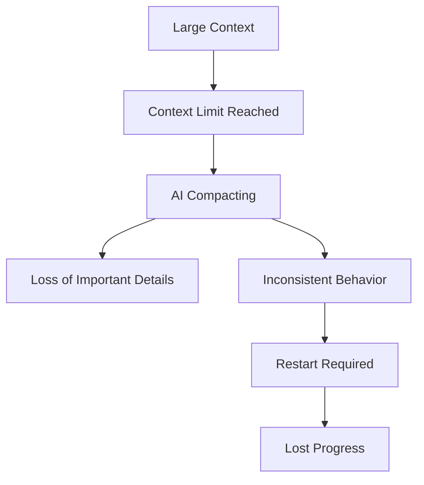
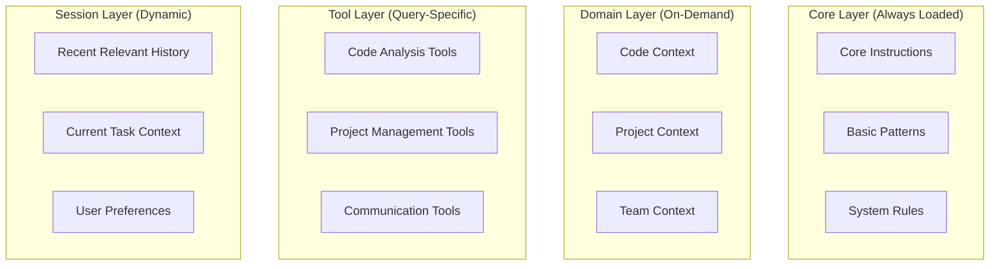
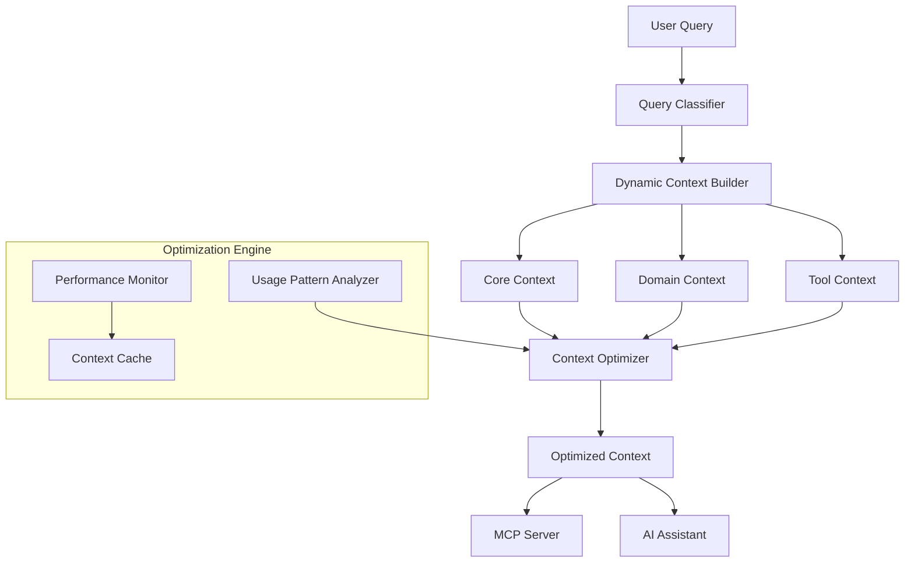

# Context Optimization: Managing Context Bloat

## The Context Bloat Problem

### Current Experience with AI Agents
```
Day 1: Agent works great with focused context
Day 5: Added more instructions, still OK
Day 10: Added MCP tools, getting slower
Day 15: Context compacting begins, losing previous context
Day 20: Agent "forgets" earlier decisions, need to restart
Result: 🔄 Constant context management overhead
```

### Root Causes of Context Bloat

#### 1. **Accumulative Context Growth**
- Instructions keep growing as edge cases are discovered
- MCP tools multiply as new integrations are added
- Conversation history becomes unwieldy
- No mechanism for context pruning

#### 2. **One-Size-Fits-All Context**
- Same massive context for simple and complex queries
- All MCP tools loaded regardless of query type
- Historical context included even when irrelevant
- No context scoping by task type

#### 3. **Context Compacting Side Effects**


## Context Optimization Strategies

### 1. **Hierarchical Context Architecture**

```python
class HierarchicalContext:
    def __init__(self):
        self.core_context = CoreContext()        # Always loaded (small)
        self.domain_contexts = {}               # Loaded on demand
        self.session_context = SessionContext() # Current conversation
        self.tool_contexts = {}                 # MCP tools by category
    
    def get_context_for_query(self, query: str, user_context: UserContext) -> OptimizedContext:
        """Dynamically assemble minimal context for specific query"""
        
        # Start with core (always included)
        context = ContextBuilder(self.core_context)
        
        # Add domain-specific context
        domains = self.classify_query_domains(query)
        for domain in domains:
            context.add_domain(self.domain_contexts[domain])
        
        # Add relevant tools only
        tools_needed = self.predict_tools_needed(query, domains)
        for tool_category in tools_needed:
            context.add_tools(self.tool_contexts[tool_category])
        
        # Add session context (recent relevant history)
        relevant_history = self.session_context.get_relevant_history(query, limit=3)
        context.add_history(relevant_history)
        
        return context.build()
```

### 2. **Context Layering Strategy**



### 3. **Smart Context Selection**

#### Query Classification for Context Selection
```python
class QueryClassifier:
    def classify_query(self, query: str) -> QueryContext:
        patterns = {
            "code_change": {
                "patterns": ["change", "update", "modify", "rename", "refactor"],
                "required_context": ["code_structure", "dependencies", "impact_analysis"],
                "required_tools": ["file_analyzer", "dependency_tracker", "impact_calculator"]
            },
            "implementation": {
                "patterns": ["implement", "create", "build", "add feature"],
                "required_context": ["architectural_patterns", "team_conventions", "similar_code"],
                "required_tools": ["pattern_finder", "convention_checker", "example_locator"]
            },
            "debugging": {
                "patterns": ["error", "debug", "fix", "not working"],
                "required_context": ["recent_changes", "error_patterns", "team_solutions"],
                "required_tools": ["error_analyzer", "change_tracker", "solution_finder"]
            },
            "question": {
                "patterns": ["how", "what", "why", "explain"],
                "required_context": ["documentation", "examples", "explanations"],
                "required_tools": ["doc_search", "example_finder"]
            }
        }
        
        # Classify and return appropriate context configuration
        return self.match_patterns(query, patterns)
```

### 4. **Context Caching and Reuse**

```python
class ContextCache:
    def __init__(self):
        self.compiled_contexts = {}  # Pre-compiled context combinations
        self.context_signatures = {} # Fingerprints of context states
        self.usage_patterns = {}     # Learning from usage
    
    def get_optimized_context(self, query_type: str, domains: List[str]) -> CompiledContext:
        """Get pre-compiled context for common query patterns"""
        
        signature = self.generate_signature(query_type, domains)
        
        if signature in self.compiled_contexts:
            # Return cached context
            return self.compiled_contexts[signature]
        else:
            # Compile new context and cache it
            context = self.compile_context(query_type, domains)
            self.compiled_contexts[signature] = context
            return context
    
    def learn_from_usage(self, query: str, context_used: Context, success_score: float):
        """Learn which context combinations work best"""
        pattern = self.extract_pattern(query, context_used)
        if success_score > 0.8:
            self.usage_patterns[pattern] = self.usage_patterns.get(pattern, 0) + 1
```

## Practical Context Optimization Techniques

### 1. **Context Summarization**
Instead of keeping full conversation history:

```python
class ContextSummarizer:
    def summarize_conversation_segment(self, messages: List[Message]) -> Summary:
        """Create condensed summary of conversation segment"""
        return {
            "key_decisions": self.extract_decisions(messages),
            "established_patterns": self.extract_patterns(messages),
            "context_assumptions": self.extract_assumptions(messages),
            "user_preferences": self.extract_preferences(messages)
        }
    
    def maintain_rolling_context(self, session: ConversationSession):
        """Keep context fresh by summarizing old segments"""
        if session.message_count > 50:
            old_segment = session.messages[:30]
            summary = self.summarize_conversation_segment(old_segment)
            session.replace_old_messages_with_summary(summary)
```

### 2. **Just-In-Time Context Loading**

```python
class JITContextLoader:
    @mcp_tool
    def get_context_for_file(self, file_path: str) -> FileContext:
        """Load context only when specific file is being worked on"""
        if not self.is_context_loaded(file_path):
            context = self.load_file_context(file_path)
            self.cache_context(file_path, context, ttl=300)  # 5 min cache
        return self.get_cached_context(file_path)
    
    @mcp_tool
    def get_related_context(self, primary_context: str, depth: int = 1) -> RelatedContext:
        """Load related context on-demand with controlled depth"""
        if depth > 2:  # Prevent context explosion
            return EmptyContext()
        
        return self.load_related_context(primary_context, depth)
```

### 3. **Context Scope Management**

```yaml
# Context scoping configuration
context_scopes:
  quick_query:
    max_tokens: 2000
    includes: [core_instructions, basic_tools]
    excludes: [full_history, complex_relationships]
    
  code_change:
    max_tokens: 8000
    includes: [core_instructions, code_patterns, dependency_analysis]
    required_tools: [file_analyzer, impact_tracker]
    
  complex_implementation:
    max_tokens: 15000
    includes: [full_patterns, architectural_context, team_history]
    required_tools: [all_code_tools, project_tools]
    
  debugging_session:
    max_tokens: 10000
    includes: [error_patterns, recent_changes, solution_history]
    required_tools: [error_analyzer, change_tracker]
```

## MCP Tool Optimization

### Problem: Too Many MCP Tools Loaded
```python
# ❌ Current approach - load everything
@mcp_server.register_tools([
    jira_tools,      # 15 tools
    github_tools,    # 12 tools  
    slack_tools,     # 8 tools
    code_tools,      # 20 tools
    doc_tools        # 10 tools
])  # Total: 65 tools always loaded
```

### Solution: Dynamic Tool Loading
```python
class DynamicMCPManager:
    def __init__(self):
        self.tool_categories = {
            "project_management": ["jira_tools", "github_issue_tools"],
            "code_analysis": ["file_analyzer", "dependency_tracker"],
            "communication": ["slack_tools", "email_tools"],
            "documentation": ["doc_search", "wiki_tools"]
        }
    
    def load_tools_for_query(self, query: str) -> List[MCPTool]:
        """Load only tools relevant to current query"""
        
        categories_needed = self.classify_tool_needs(query)
        tools_to_load = []
        
        for category in categories_needed:
            tools_to_load.extend(self.tool_categories[category])
        
        # Load tools dynamically
        return self.activate_tools(tools_to_load)
    
    @mcp_tool
    def expand_tool_access(self, needed_category: str) -> str:
        """Allow agent to request additional tools mid-conversation"""
        if self.is_valid_expansion(needed_category):
            new_tools = self.load_tool_category(needed_category)
            return f"Loaded {len(new_tools)} additional tools for {needed_category}"
        else:
            return f"Tool category {needed_category} not available or not needed"
```

## Context Optimization Architecture for Our System

### Context Optimization Layer


## Implementation Strategy

### Phase 1: Context Classification (Week 1-2)
- [ ] Build query classifier for context needs
- [ ] Implement basic context layering
- [ ] Create context size monitoring

### Phase 2: Dynamic Loading (Week 3-4)  
- [ ] Implement JIT context loading
- [ ] Dynamic MCP tool loading
- [ ] Context caching system

### Phase 3: Optimization Engine (Week 5-6)
- [ ] Usage pattern learning
- [ ] Context summarization
- [ ] Performance optimization

### Phase 4: Advanced Features (Week 7-8)
- [ ] Predictive context loading
- [ ] Context compression algorithms
- [ ] Multi-agent context coordination

## Success Metrics

### Performance Metrics
- **Context Size Reduction**: Target 60-70% reduction for typical queries
- **Response Time**: Sub-2 second responses for common queries
- **Cache Hit Rate**: >80% for repeated query patterns
- **Compacting Events**: Reduce by 90% through better context management

### User Experience Metrics
- **Context Continuity**: Maintain relevant context across session
- **Query Success Rate**: High-quality responses with minimal context
- **Restart Frequency**: Reduce agent restarts by 95%
- **Developer Satisfaction**: Improved workflow continuity

Ten problem context bloat jest kluczowy dla rzeczywistego wykorzystania AI w development. Nasz system powinien być wzorcem w optymalizacji kontekstu!