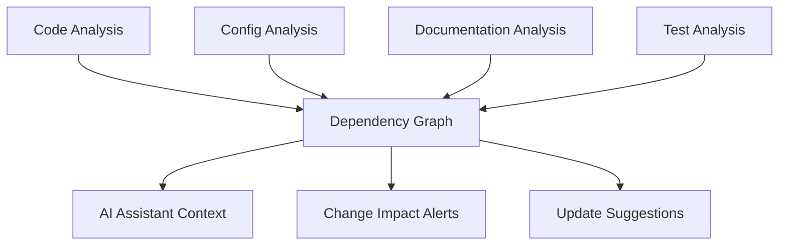

# Cross-File Dependencies and AI Blind Spots

## Problem Statement

**Core Issue**: AI assistants frequently make changes to one file without recognizing and updating related dependencies in other files, leading to broken functionality and inconsistent codebase state.

## Real-World Examples

### Example 1: Controller → Properties → HTTP Files Chain
```
Controller.java
├── Uses @Value("${app.feature.enabled}")
├── References property: app.feature.enabled
├── 
Properties files
├── application.yml: app.feature.enabled: true
├── application-dev.yml: app.feature.enabled: false
├──
HTTP test files
├── requests.http: ### Test feature endpoint
├── test-scenarios.http: # Assumes feature is enabled
```

**What happens**:
1. AI changes controller to rename property to `app.new-feature.enabled`
2. AI doesn't update application.yml files
3. AI doesn't update HTTP test files that rely on the feature
4. Tests fail, local dev breaks, inconsistent state

### Example 2: Database Entity → Migration → Test Data
```
User.java
├── @Column(name = "email_address")
├── 
Migration files  
├── V001__create_users.sql: CREATE TABLE users (email_address VARCHAR(255))
├── V002__add_indexes.sql: CREATE INDEX idx_email ON users(email_address)
├──
Test files
├── UserTest.java: user.setEmailAddress("test@example.com")
├── test-data.sql: INSERT INTO users (email_address) VALUES (...)
├── user-requests.http: "emailAddress": "test@example.com"
```

**What happens**:
1. AI changes entity field name from `emailAddress` to `email`
2. AI doesn't update migration files
3. AI doesn't update test data
4. AI doesn't update HTTP requests
5. Database schema mismatch, tests fail

### Example 3: Config Class → Environment Variables → Docker/K8s
```
DatabaseConfig.java
├── @Value("${db.connection.pool.size:10}")
├── 
Environment setup
├── .env: DB_CONNECTION_POOL_SIZE=20
├── docker-compose.yml: DB_CONNECTION_POOL_SIZE=15
├── k8s-config.yaml: value: "25" # for db.connection.pool.size
├──
Documentation
├── README.md: "Set DB_CONNECTION_POOL_SIZE environment variable"
├── deployment-guide.md: "Default pool size is 10"
```

**What happens**:
1. AI changes config property from `db.connection.pool.size` to `database.pool.max-size`
2. AI doesn't update environment files
3. AI doesn't update deployment configurations
4. AI doesn't update documentation
5. Deployment fails, documentation is outdated

## Types of Cross-File Dependencies

### 1. **Code-Level Dependencies**
- **Import statements**: Class moved/renamed but imports not updated
- **Method signatures**: Interface changes not reflected in implementations
- **Constants/Enums**: Values changed but usages not updated
- **Configuration properties**: Property names changed but not in config files

### 2. **Configuration Dependencies**
- **Property files**: application.yml, .properties, .env files
- **Docker/Container configs**: Environment variables, volume mounts
- **CI/CD configs**: Pipeline variables, deployment scripts
- **Infrastructure as Code**: Terraform, K8s manifests

### 3. **Data Dependencies**
- **Database schemas**: Entity changes not reflected in migrations
- **Test data**: Fixtures, seed data, mock responses
- **API contracts**: OpenAPI specs, request/response examples
- **Sample data**: Documentation examples, HTTP files

### 4. **Documentation Dependencies**
- **API documentation**: Endpoint changes not updated in docs
- **README files**: Configuration examples outdated
- **Code comments**: Inline comments referencing old names/values
- **Architecture diagrams**: Component names/relationships outdated

### 5. **Test Dependencies**
- **Unit tests**: Mock data, expected values
- **Integration tests**: Test configurations, endpoints
- **E2E tests**: Test scenarios, data setup
- **Performance tests**: Load test scripts, expected metrics

## Current AI Assistant Limitations

### GitHub Copilot
- **Strengths**: Good at single-file context
- **Weaknesses**: Limited cross-file awareness, no configuration file understanding
- **Example**: Renames method but doesn't find all usages across files

### Cursor
- **Strengths**: Better multi-file context than Copilot
- **Weaknesses**: Still misses non-code dependencies (config, docs, tests)
- **Example**: Updates code but misses corresponding HTTP test files

### ChatGPT/Claude
- **Strengths**: Can reason about dependencies when explicitly told
- **Weaknesses**: No real-time codebase access, relies on user providing context
- **Example**: Gives good advice but can't automatically find all related files

## Impact Analysis

### Developer Time Waste
- **Debugging time**: 30-60 minutes to find broken dependencies
- **Context switching**: Multiple files to update manually
- **Testing time**: Running tests to discover what broke
- **Documentation time**: Updating related documentation

### Code Quality Issues
- **Inconsistent state**: Half-updated codebase
- **Silent failures**: Tests pass locally but fail in different environments
- **Documentation drift**: Code and docs become out of sync
- **Technical debt**: Accumulation of inconsistent naming/patterns

### Team Coordination Problems
- **Review complexity**: PRs harder to review when changes are incomplete
- **Integration issues**: Other team members' work breaks
- **Deployment risks**: Environment-specific failures
- **Knowledge gaps**: Understanding what needs to be updated

## Solution Requirements

### Real-Time Dependency Mapping


### Required Capabilities
1. **Multi-file Change Detection**
   - Track property names across different file types
   - Understand naming conventions (camelCase vs kebab-case vs snake_case)
   - Map configuration keys to code references

2. **Impact Analysis**
   - Show all files that would be affected by a change
   - Categorize impact (breaking, non-breaking, documentation-only)
   - Estimate effort to complete all related changes

3. **Automated Change Propagation**
   - Suggest related changes across all affected files
   - Generate complete change sets for review
   - Validate that all dependencies are addressed

4. **Validation and Testing**
   - Run affected tests automatically
   - Check configuration validity
   - Verify documentation consistency

## Technical Approach for Our System

### 1. Dependency Graph Construction
```python
# Example dependency relationships we need to track
dependencies = {
    "property_references": {
        "app.feature.enabled": [
            "src/main/java/Controller.java:42",
            "src/main/resources/application.yml:15",
            "src/test/resources/requests.http:8",
            "docs/configuration.md:23"
        ]
    },
    "method_references": {
        "UserService.findByEmail": [
            "UserController.java:30",
            "UserTest.java:45",
            "integration-tests/user-flow.http:12"
        ]
    },
    "schema_references": {
        "users.email_address": [
            "User.java:@Column annotation",
            "migrations/V001__users.sql:CREATE TABLE",
            "test-data.sql:INSERT statements",
            "user-api.http:request body"
        ]
    }
}
```

### 2. Cross-File Pattern Recognition
- **Configuration patterns**: `${property.name}` → `application.yml`
- **HTTP patterns**: `POST /api/users` → `@PostMapping("/api/users")`
- **Test patterns**: `assertEquals(expected, user.getEmail())` → `User.setEmail()`
- **Documentation patterns**: ` ```java UserService.findByEmail()` → `UserService.java`

### 3. Change Impact Analysis
- **Immediate impact**: Direct references that will break
- **Cascade impact**: Changes that might cause further changes
- **Documentation impact**: Places where examples/explanations need updates
- **Test impact**: Tests that need data/expectations updated

### 4. AI Assistant Integration
When AI suggests a change:
1. **Pre-change analysis**: "This change will affect 7 other files"
2. **Complete change set**: "Here are all the related changes needed"
3. **Validation**: "These tests should be run to verify the changes"
4. **Documentation updates**: "These documentation sections need updates"

## Research and Development Plan

### Phase 1: Dependency Discovery (2 weeks)
- [ ] Build parsers for common file types (.java, .yml, .properties, .http)
- [ ] Create dependency extraction algorithms
- [ ] Test with real-world codebases

### Phase 2: Impact Analysis (2 weeks)
- [ ] Develop change impact algorithms
- [ ] Create visualization tools for dependency graphs
- [ ] Test accuracy of impact predictions

### Phase 3: AI Integration (3 weeks)
- [ ] Integrate with MCP protocol
- [ ] Provide context to AI assistants
- [ ] Test with real AI-assisted development scenarios

### Phase 4: Validation (2 weeks)
- [ ] Automated testing integration
- [ ] Configuration validation
- [ ] Documentation consistency checks

This specific problem of cross-file dependencies is exactly why our system is needed - it's a perfect example of where current AI tools fall short and where a comprehensive knowledge system can provide real value.